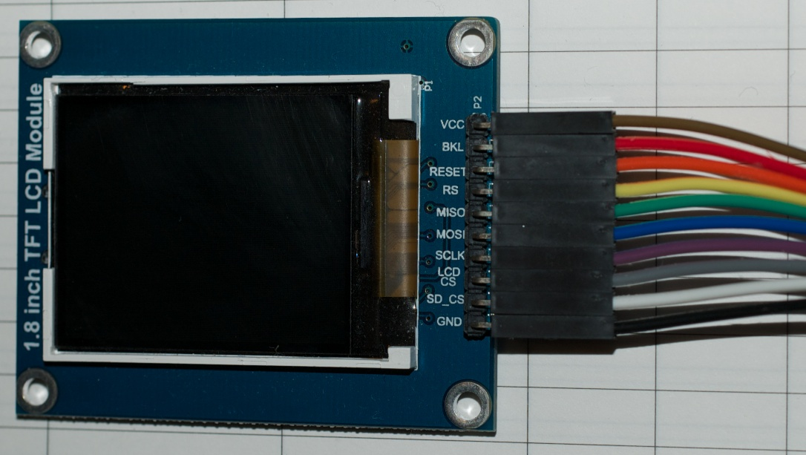
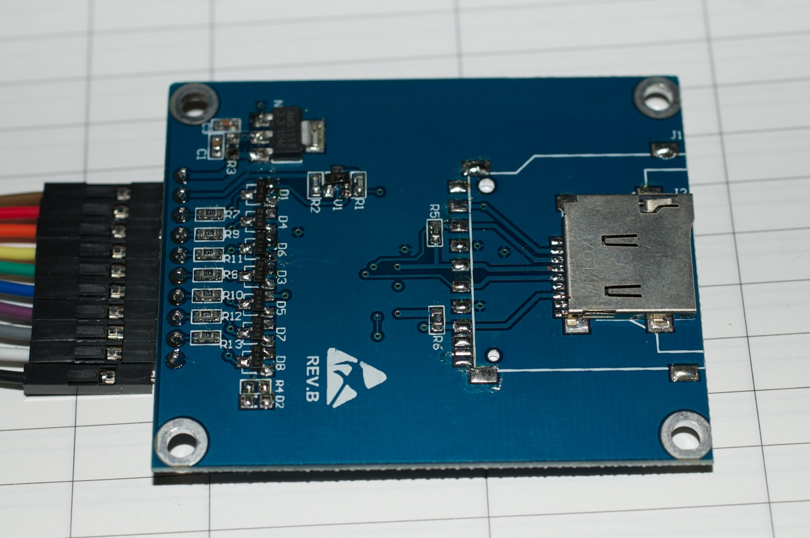

1.8" TFT Display - 128x160 pixels in high colour with a microSD socket
----------------------------------------------------------------------

This article serves to document a cheap TFT LCD purchased from eBay,
it's a cheap Chinese clone of the breakout board produced by
[Adafruit](http://www.ladyada.net/products/18tftbreakout/), but it has
some pinout differences, mostly naming but there is one electrical
difference; specifically, the backlight connection - BKL needs to be
grounded, rather than connected to +5 V as in the Adafruit design. The
table lists the eBay and Adafruit names together with the pins used for
the fast SPI demos in the Arduino ST7735R library

|                 |                     |                             |
|-----------------|---------------------|-----------------------------|
| *' eBay Board*' | *' Adafruit Board*' | **Arduino conections**      |
| VCC             | VCC                 | 5V                          |
| BKL             | LITE                | GND on eBay, 5V on Adafruit |
| RESET           | RESET               | 8                           |
| RS              | D/C                 | 9                           |
| MISO            | MISO                |                             |
| MOSI            | MOSI                | 11                          |
| SCLK            | SCLK                | 13                          |
| LCD CS          | TFT CS              | 10                          |
| SD CS           | CARD CS             |                             |
| GND             | GND                 | GND                         |

The eBay module looked to have a few dodgy solder joints when inspected
under a magnifier, so I reworked all the joints on the back side of the
board to be sure they were good. The board has been tested with the
Arduino ST7735R library in fast SPI mode and performs well. My intention
is to use this LCD module with a dsPIC part in a project I have in mind.
