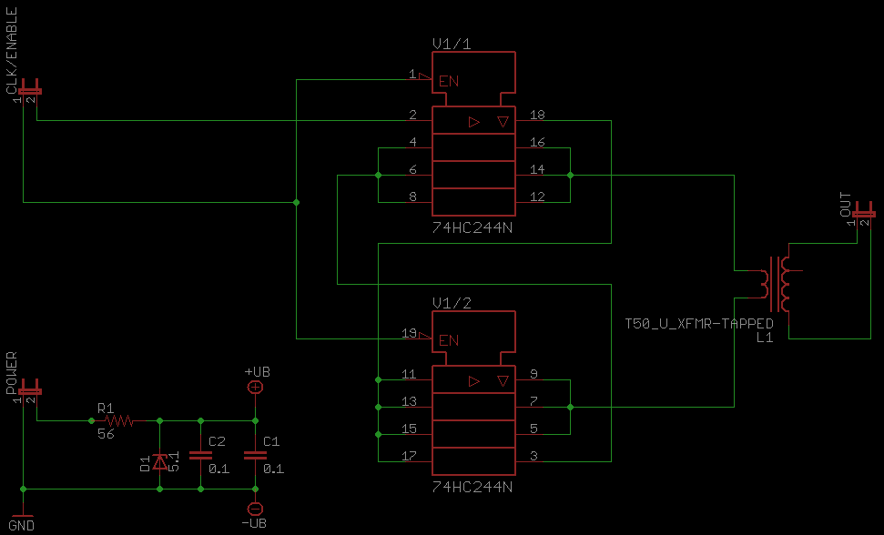
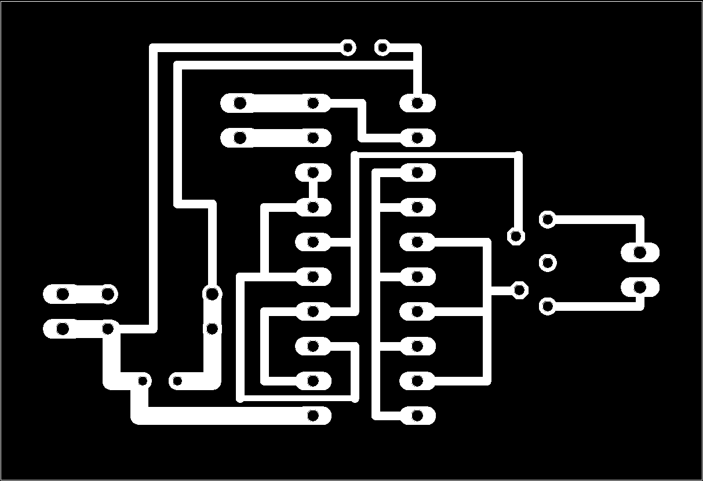
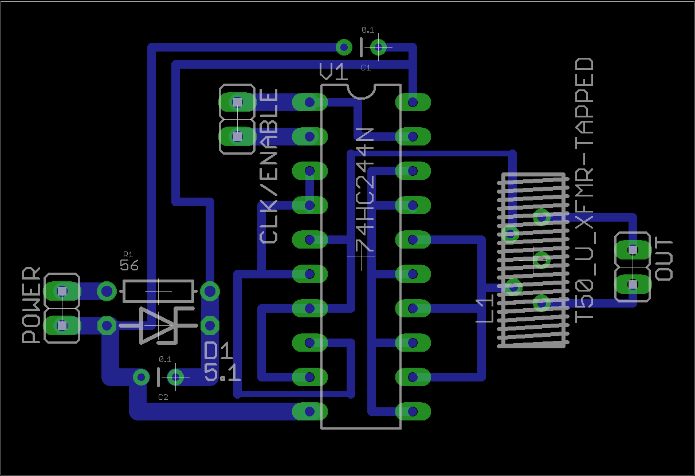

74HC240 / 74HC244 Buffer / PA stage
-----------------------------------

The 74HC240 Tri-state octal inverting buffer IC has been used as a
simple low power buffer amp and PA stage for QRP radios since N7KSB
first investigated its use many years ago. The 74HC244 IC, a non
inverting version of the '240 can also be used in this application.

I needed a small PA stage for my [QRSS beacon](/wiki/QRSS_Beacon "wikilink")
so I designed this PCB for the task. The board is supplied with 8 to 10
V, the output of an oscillator (at least 1v peak to peak) and an enable
signal (to turn on the PA) and you get approx 300mW at the output,
sufficient to drive an IFR510 or similar device for even more power.

------------------------------------------------------------------------

**Schematic**

The output transformer is 5 turns tri-filar wound on a T50-2 or similar
toroid.

------------------------------------------------------------------------

**PCB**

This PCB mas should be printed at 600x600dpi for accurate sizing. Click
image to download full sized version for printing.

**Layout of parts on PCB**

