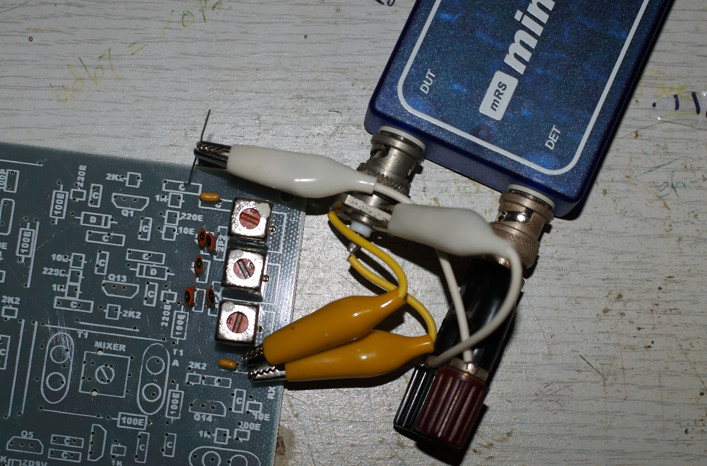

Building a BitX 20 Radio
------------------------

The BitX 20 is a 20m band SSB transeiver originally designed in India by
Ashar Frahan, and now supported and developed by by many people. My BitX
is a version 3, built on a PCB ordered from Sunil Lakhani VU3SUA.

**Band Pass Filter** The BitX bp-filter is simply constructed from three
Toko coils and a handfull of NPO capacitors.

