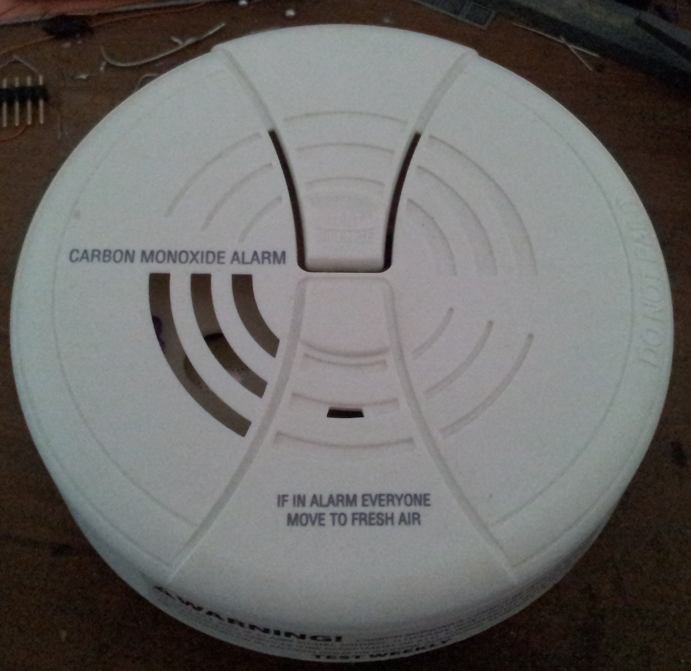
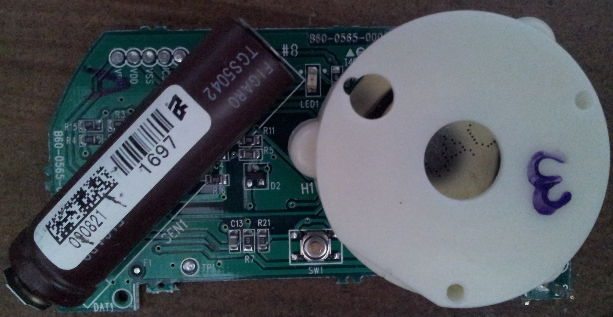
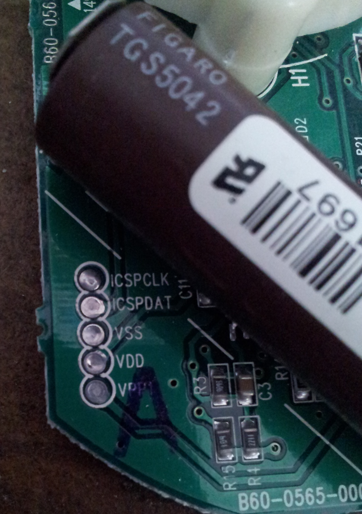
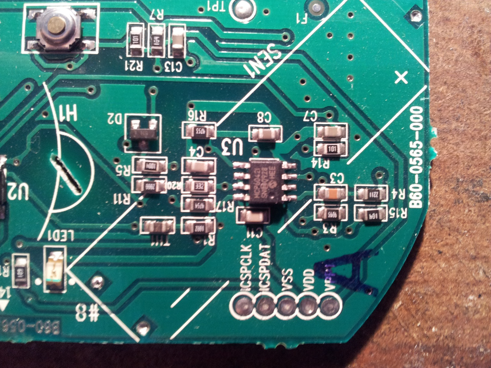
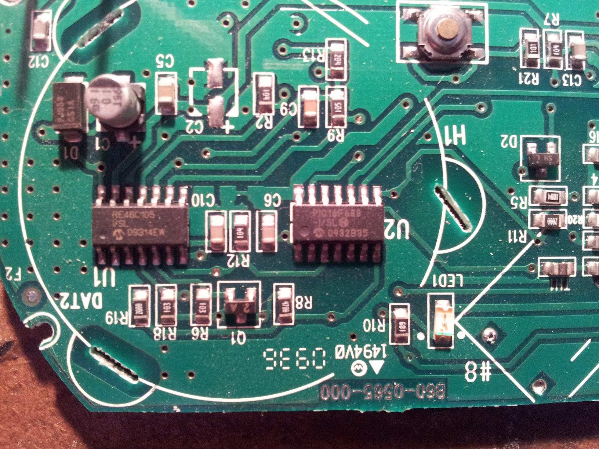

My British Gas supplied carbon monoxide sensor started bleeping at me,
not the usual battery-dying bleep code, but a rather more serious
detector-malfunction bleep code. This makes it fair game for a teardown!

  
  
  
  

The PCB  
---------

The whole of the alarm is implemented on a single PCB, the two most
obvious parts being the electrochemical sensor and the piezo sounder.
Just peaking out from under the sensor is something that looks rather
like a Microchip PIC ISCP port header.  

The Sensor
----------

The carbon monoxide sensor is a [Figaro
TGS5042](http://www.figarosensor.com/products/5042Dtl.pdf), this is an
electrochemical device that generates an electrical current that depends
upon the concentration of carbon monoxide that defuses into the body of
the device. As with all sensors of this type, the device has a limited
working life - failure being sure to the liquid electrolytes drying out.

The 2-D barcode encodes quite a bit of information about this sensor,
but I've not found anything that can read it. The number under the
standard barcode is the output current in nano-amps / parts per million
(nA/ppm), so this sensor produces 1.697 nA when exposed to 1ppm CO. A
pretty high gain current to voltage amplifier is required to turn this
tiny current into something a micro-controller or logic device can deal
with.

The analog amplification and processing sits right under the sensor. The
active device is a Microchip
[MCP6042](http://www.microchip.com/wwwproducts/Devices.aspx?dDocName=en010444)
low power dual operational amplifier, likely wired as a trans-impedance
amplifier (not checked the circuit yet).

The Processor
-------------

The presence of an ICSP header is a give away that the alarm uses a
Microchip PIC type processor, and when we remove the piezo sounder we
spot a
[PIC16F688](http://ww1.microchip.com/downloads/en/DeviceDoc/41203E.pdf).
There is also a Microchip
[RE46C105](http://ww1.microchip.com/downloads/en/devicedoc/22167a.pdf)
piezo sounder driver. There's no other voltage regulation or voltage
dropping on the board, so at first I couldn't see how the pic ran from
the 9V battery supply, a closer reading of the datasheet for the piezo
driver mentions a built in voltage regulator selectable at either 5V or
3.3V, depending on pin 12 (low = 3.3V, high = 5V).

### Reading the PIC

With my trusty PICkit-2 programmer, I was able to dump out the code from
the processor via the ICSP port. There was no code protection and the
hex dump doesn't seem to have any encryption or obfuscation. There are
no obvious text strings in the code, but this device never interfaces to
the external world apart from some bleeps and an LED flash, so there's
no need for any human readable data. I ran the hex though a simple
disassembler, nothing very odd leaps out, but it is quite a few years
since I programmed a 16-series PIC in assembler - I could well be
missing something interesting. The hexdump and assembly code are in an
[archive](/wiki/Media:Co-pic-code.zip "wikilink") for downloading - have a
play and let me know if you discover how it works.  

