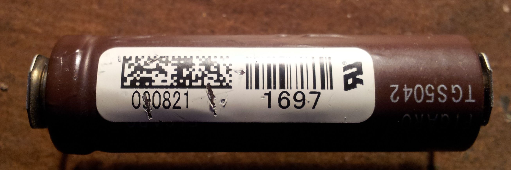

My British Gas supplied carbon monoxide sensor started bleeping at me,
not the usual battery-dying bleep code, but a rather more serious
detector-malfunction bleep code. This makes it fair game for a teardown!

  
  
  
  

The PCB  
---------

The whole of the alarm is implemented on a single PCB, the two most
obvious parts being the electrochemical sensor and the piezo sounder.
Just peaking out from under the sensor is something that looks rather
like a Microchip PIC ISCP port header.  

The Sensor
----------

The carbon monoxide sensor is a [Figaro
TGS5042](http://www.figarosensor.com/products/5042Dtl.pdf), this is an
electrochemical device that generates an electrical current that depends
upon the concentration of carbon monoxide that defuses into the body of
the device. As with all sensors of this type, the device has a limited
working life - failure being sure to the liquid electrolytes drying out.

The 2-D barcode encodes quite a bit of information about this sensor,
but I've not found anything that can read it. The number under the
standard barcode is the output current in nano-amps / parts per million
(nA/ppm), so this sensor produces 1.697 nA when exposed to 1ppm CO. A
pretty high gain current to voltage amplifier is required to turn this
tiny current into something a micro-controller or logic device can deal
with.

The analog amplification and processing sits right under the sensor.
