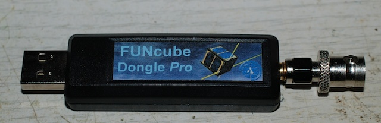

Documenting my experiments with a FUNcube Dongle
------------------------------------------------

The FUNcube Dongle is a small USB hosted Software Defined Radio (SDR)
covering 60 MHz to 2 GHz. The hardware itself is just a tunable
down-converter, transforming a 90 kHz chunk of RF bandwidth to
approximately 80 kHz of audio bandwidth, all demodulation and further
filtering and processing is performed in software on the hosting
computer.

