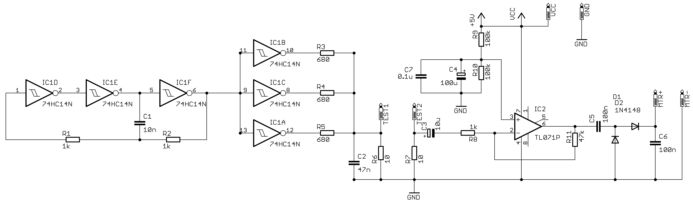
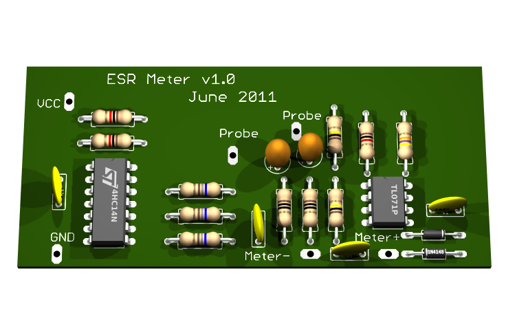
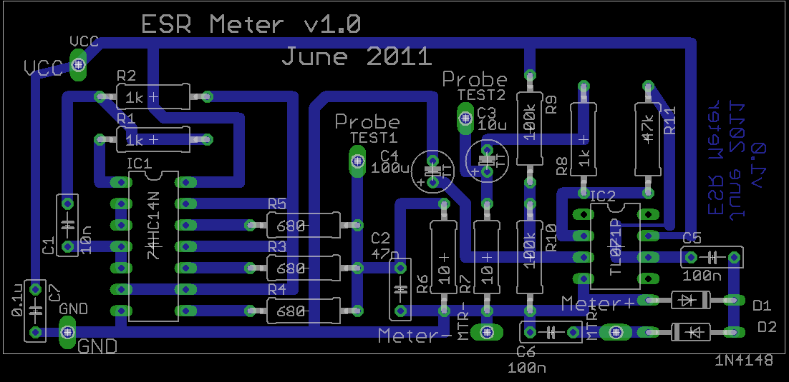

An Equivalent Series Resistance Meter
-------------------------------------

Some time ago I was trying to repair a switched mode power supply (SMPS)
in my oscilloscope. I'd been quoted £800 for a new PSU, so trying to fix
it first was well worth my while. It's pretty common for electrolytic
capacitors to develop faults in an SMPS; specifically they develop an
higher than normal internal resistance. So while the capacitor may hold
a charge and measure as the correct capacitance, it will not behave
correctly in a filter or PSU circuit. The ESR of a large high voltage,
high capacity electrolytic capacitor should be fractions of an Ohm,
smaller capacitors have ESRs of a few Ohms typically. As the capacitor
degrades in use the ESR can easily climb to several hundred times the
normal value, while exhibiting no changes to voltage and capacitance
ratings

Suspecting the capacitors, and not having a way to measure their series
resistance, I set out to design and build an ESR meter. We can't measure
ESR with a normal DC Ohm meter, because the DC voltage would charge the
capacitor. An AC signal is used, so that it passes straight though the
capacitor with minimal reactive losses. As a ball-park figure, I decided
my ESR meter design would operate at around 25kHz, where a 100μF cap has
a reactance of about 60 mOhm (a 1μF cap has a reactance of about 6 Ohms
at this frequency). I also decided to keep the test voltage below about
0.6 V, so as not to forward bias any semiconductors in the circuit under
test. I want to be able to test capacitors in circuit where possible.

A three stage inverter RC oscillator starts much more reliably than a
two stage oscillator. This provides a 25 kHz 0-5 V square wave, which is
buffered by the other three gates in IC1, increasing the current output
capability. R3,R4,R5 and R6 form a potential divider, so that only
around 200mV is applied to the device under test - low enough that
capacitors can be tested in circuit without turning on any
semiconductors.

C3 provides DC isolation for the opamp, but don't rely on this to save
you from a charged mains capacitor in a SMPS - always discharge before
you test. You could also put a 10k resistor across the probes to help
ensure capacitors are discharged - 10k is a much higher resistance than
the meter can detect, so it will not affect ESR readings.

The opamp IC2, provides plenty of amplification for the AC signal passed
though the capacitor under test, the output of the opamp is rectified by
diodes D1 and D1 and applied to the meter. I use a 4.7k pot in series
with the meter to set zero resistance with the probes shorted together
for calibration. The exact value of the series pot will depend on the
sensitivity of the meter used.

The circuit is powered by 4 AA cells, and draws &lt;10 mA, so the
batteries should last a long time. 

------------------------------------------------------------------------

**Calibration** I made a calibration standard from 10x 1Ohm 1% metal
oxide resistors in series with two 10 Ohm metal oxide 1% resistors. With
the meter zeroed with the probes shorted together, I measured first 1
resistor (1 Ohm) and marked the meter scale, then two resistors (2
Ohms), until I had marked up to 10 Ohms. Then 11 to 30 Ohms by adding 1
then two 10 Ohm resistors to the measurement.

------------------------------------------------------------------------

**Chops and Changes**

There isn't anything difficult to obtain to build this meter, no coils
or transformers to wind, no crystals to obtain. IC1 really should be a
Schmitt trigger device, so the oscillator functions. Rectifier diodes
D1&D2 would probably be better replaced with Schottky diodes, so there
is less voltage dropped in the rectifier and more left to drive the
meter. R8 and R11 set the amplification factor of the opamp, the values
suggested work, but are not optimized, if you find you have insufficient
gain to zero the meter, here is a good place to look (or use fresh
batteries)

------------------------------------------------------------------------

**Resources**

[Zip archive containing Eagle CAD files for this
project](media:ESR_Meter.zip "wikilink")
