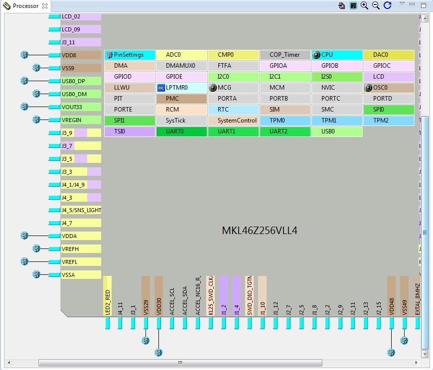

FRDM KL46Z Blink
----------------

This article is intended to document how I got started with developing
for the Freescale FRDM-KL46Z board using Kinetis Design Studio and
Processor Expert software as these are freely available from the
Freescale website.

  
`Creating a new project, I used the settings shown here.`

 And select the
target board on the next screen. I'm assuming that selecting a specific
development board rather than just a processor will set up some of the
pin mappings to LEDs, switches and the LCD, also set the clock
correctly, etc.
 I've chosen
processor expert here and standalone because I don't know any better.
I'm guessing standalone will stop the compiler crapping over any already
build files elsewhere. I may be wrong.
 The processor pin
mapping screen looks about right to me, I can see the pin I plan to use
is named LED2\_RED, but doesn't have a “normal” pin name by it as the
pin next to it does. I'm not sure what this means yet. I think the name
show on this screen must be defined for use in the user's code.
 The GPIO
components available for use in the next window pane don't sem to match
up with any of those shown in the few tutorials that document develpment
with these boards.

This is where I'm now stuck. I hope to be able to update this page soon
with useful information.
