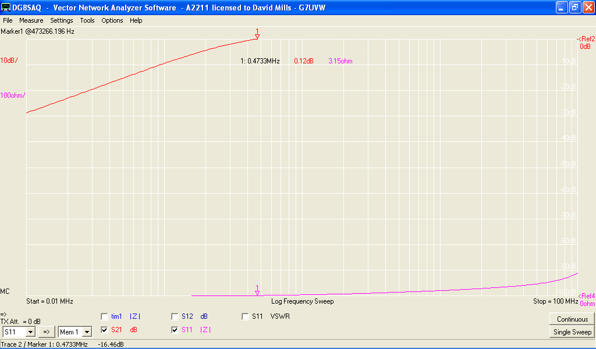
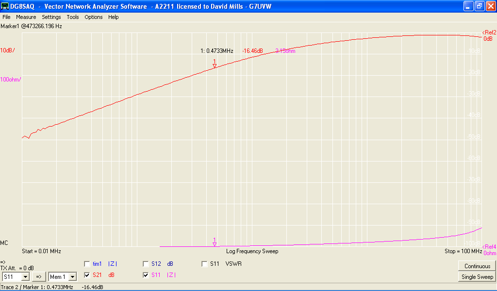

Testing low frequency losses in broadband transformers materials
----------------------------------------------------------------

In the cause of converting a Softrock Lite II receiver to work on the
new 472kHz (660m) amateur band, I found I needed a broadband transformer
with low loss characteristics at these frequencies. The recommended core
material to construct broadband transformers at low radio frequencies is
75-mix ferrite, I had none to hand, so I've decided to measure up what I
do have handy.

Methods
-------

Construct a tri-filiar winding of 5 turns on both FT50-43 and FT50-26
cores, keeping the windings as close to identical as possible. Insertion
loss (S21) between two pairs of the windings will be measured with a
DG8SAQ VNWA. The third winding will be left unconnected.  
Loss will be measured from 10 kHz to 100 MHz and plotted on a log
frequency scale. A spot measurement of S21 at 473kHz will also be made.

<File:Ft50-43.jpg%7CFT50-43> Transformer <File:Ft50-26.jpg%7CFT50-26>
Transformer

  

Results
-------

The results are not what I expected to see, I'd been lead to believe
that 43-mix material wasn't much use below around 1MHz. and that 26-mix
material would be significantly better. It should be noted that errors
in S21 measurement are estimated at approximately +/- 0.25 dB.

### FT50-43

This material is just about usable at 473 kHz, there is essentially zero
loss between pairs of windings. The frequency response of the material
rolls of very rapidly below 300 kHz, so it's useless for the 136kHz
band.

### FT50-26

I checked
and rechecked this measurement because I didn't expect it to be so bad.
16dB loss at 473kHz is hopeless for my application.

Conclusions
-----------

I'll make my transformer from 43-mix material unless I can get some
75-mix soon. I'll post up measurements of the transformer I end up
using. It may also be instructive to try other common cores powdered
iron and see how they compare.

  

<Category:Projects> <Category:Radio> <Category:Testgear>
<Category:Electronics>
