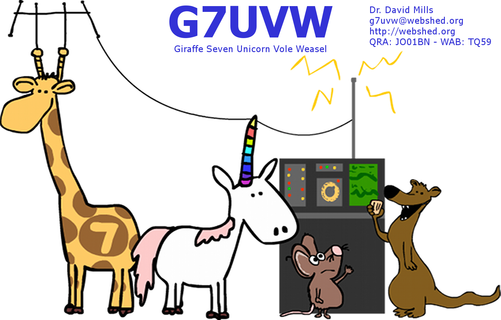

Radio Callsign G7UVW
--------------------

Since the mid 1990s I've held a few different callsigns for various
classes of operation.

-   2E1CZR - My old Class-B novice callsign
-   M3UVW - A short lived call I held after passing the 5WPM Morse test
    to access the HF bands - Ran in conjunction with:
-   G7UVW - My current, and longest lived callsign. A full class
    license, the highest class available in the UK.

------------------------------------------------------------------------

QSL card
--------

