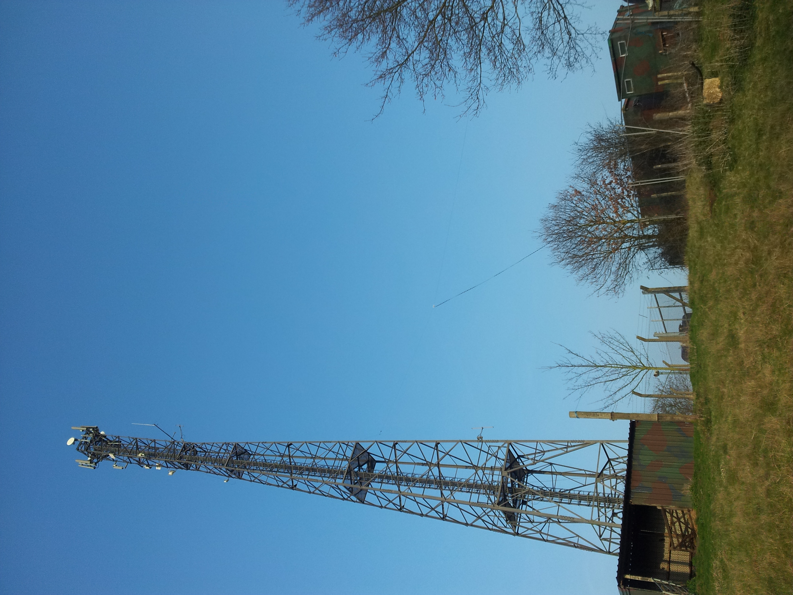

GB0**SNB** Special Event Station at Kelvedon Hatch **S**ecret **N**uclear **B**unker
------------------------------------------------------------------------------------

GB0SNB is the amateur radio callsign for the special event radio station
at the [Kelvedon Hatch nuclear
bunker](http://www.secretnuclearbunker.com), a few miles outside
Brentwood in Essex, UK. It is operated and maintained by members of the
(now defunct) Barking Radio and Electronics Society. More information
about the station can be found on the QRZ.com page [GB0SNB on
QRZ.com](http://www.qrz.com/db/gb0snb).

The Station currently operates a permanent
[APRS](https://en.wikipedia.org/wiki/Automatic_Packet_Reporting_System)
node on 145 MHz - 2 meters, and a temporary multiband low-power
[WSPR](http://physics.princeton.edu/pulsar/K1JT/wspr.html) transmitter
on the HF bands; live WSPR 'spots' for this transmitter can be viewed on
the [WSPRnet Propagation
Map](http://wsprnet.org/drupal/wsprnet/map&band=All&callsign=gb0snb&latitude=20&longitude=20&minutes=600).
The HF antenna is a [ZS6BKW wire antenna](/wiki/ZS6BKW_antenna "wikilink")
similar to the ever popular G5RV, but with better return loss and SWR
characteristics over most HF bands.

