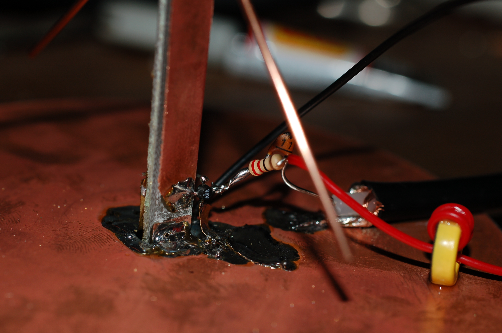
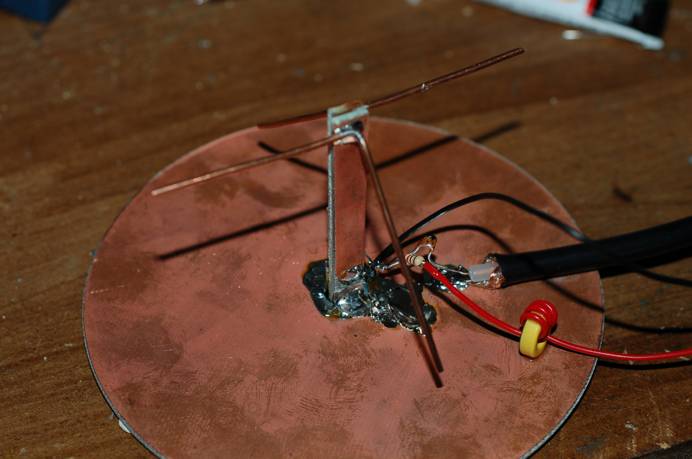

A simple amplified GPS antenna
------------------------------

I was in need of an external antenna for my Trimble GPS Disciplined
frequency standard. This design is based on the N7KKQ design from the
October 2002 issue of QST. The Trimble needs &gt;25dB of gain to lock to
the GPS data, so I added a single stage MMIC amp. This was mounted as
close as possible to the antenna (actually on the microstrip down lead)
and can be seen in the photograph below.

  
The MSA-0886 MMIC is the tiny black blob with four legs. The 22 Ohm
resistor provides bias to the MMIC and the 11pF capacitor is blocking
the DC supplied from the Trimble (it only supplies 5V, which is too low
for this MMIC device). The bright yellow inductor is there to prevent
our precious amplified signal from vanishing into the power supply.

This version of the amp and antenna does not provide enough gain to
reliably lock the Trimble unit. Lock is very sporadic. This could be
fixed by adding another stage of amplification or moving to a higher
gain MMIC device. For now this is good enough to work as an extra
antenna for another of my GPS receivers.
