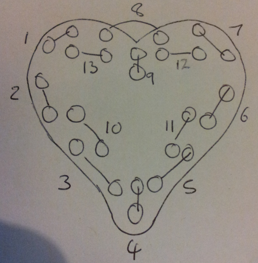
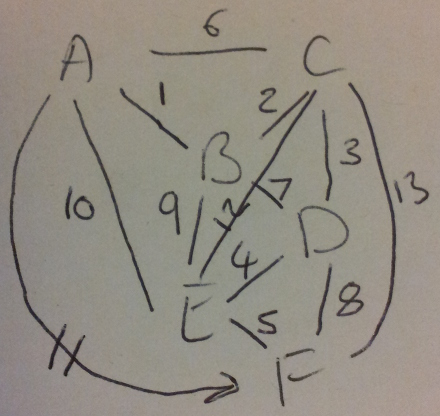

Heart Blinkenlights
-------------------

I wanted to make something for my partner for Valentine's Day 2014.
Browsing the local Maplin shop, I came across a
[Velleman](http://www.maplin.co.uk/p/velleman-mk101-flashing-sweetheart-led-kit-vx75s)
kit in the shape of a heart with ~30 LEDs. In its standard frm, the kit
just flashes all the LEDs on and off at a few Hz - it's just a two
transistor astable circuit - nothing too exciting. I bought it and
started thinking about how to upgrade it once I had it back in the
workshop.

First off, I ditched the 3mm LEDs and plumped for some 5mm ultra high
brighness ones, unfortunately I ordered 8mm by mistake so some filing
and brute force was needed to get them to fit the PCB. I'd wanted to try
[charlieplexing](https://en.wikipedia.org/wiki/Charlieplexing)  for some
time, so this seemed like a good opotunity. I had some PIC16F883 devices
in SMT form in the spares bin , these are small enough to fit on the
back of the heart PCB and will run with no extra parts - that made
selection of controller easy - use those.

### LED Placement

At the time I soldered the LEDs on the PCB I hadn't though too much
about how to address them via charlieplexing, so I just had them in
pairs, anti-parallel. I can always fix the addressing in software -
however this does make for some odd looking code at times. It would have
been much nicer to have been consistent with placing the LEDs such that
the topmost of each pair was always at the lowest (or highest) address.
The image shows how a few of the LEDs had to have some extreme
modification with a file to fit the board.

To charliplex 26 LEDs requires 6 wires. Numbering the LED pairs and
drawing the connection graph gives the addresses and the data bytes we
needs to control which LED is on at any given time.

This gives the following mapping:

|         |             |             |
|---------|-------------|-------------|
| Wire ID | LEDs        | Wire Colour |
| A       | 1,6,10,11   | Blue        |
| B       | 1,2,7,9     | White       |
| C       | 2,3,6,12,13 | Orange      |
| D       | 3,4,7,8     | Yellow      |
| E       | 4,5,9,10,12 | Brown       |
| F       | 5,8,11,13   | Red         |

### Animation  

I decided I wanted a chasing light animation around the LEDs, speeding
up each pass followed by a left-right wipe and something else (undecided
as i fired up the compiler). The initial code I wrote was just to test
the LEDS, it cycles though each LED pair address and alternates which of
the pair is on - this was to check the wiring was correct and to form a
basic program to build upon.

Two have more than one LED apear to be on in a charlieplexing scheme you
need to flash the LEDs quickly and reply on persistance of vision to
make them seem on fully.

Thw way I implemented the address and data scheme is far from optimal -
given more time I'd have written the code in a more sensible style,
however the microcontroller is running at 8 MHz so ai have CPU sysle to
spare, there is more than enough program space for the cde as it stands
