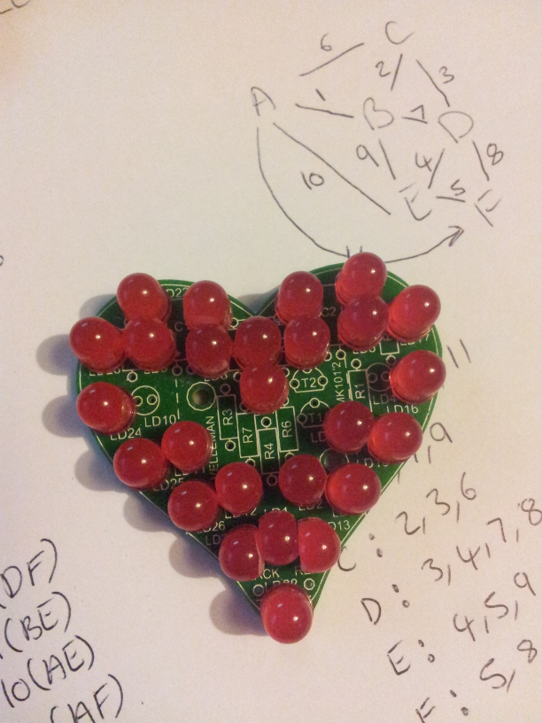

Heart Blinkenlights
-------------------

I wanted to make something for my partner for Valentine's Day 2014.
Browsing the local Maplin shop, I came across a
[Velleman](http://www.maplin.co.uk/p/velleman-mk101-flashing-sweetheart-led-kit-vx75s)
kit in the shape of a heart with ~30 LEDs. In its standard frm, the kit
just flashes all the LEDs on and off at a few Hz - it's just a two
transistor astable circuit - nothing too exciting. I bought it and
started thinking about how to upgrade it once I had it back in the
workshop.

First off, I ditched the 3mm LEDs and plumped for some 5mm ultra high
brighness ones, unfortunately I ordered 8mm by mistake so some filing
and brute force was needed to get them to fit the PCB. I'd wanted to try
[charlieplexing](https://en.wikipedia.org/wiki/Charlieplexing)  for some
time, so this seemed like a good opotunity. I had some PIC16F883 devices
in SMT form in the spares bin , these are small enough to fit on the
back of the heart PCB and will run with no extra parts - that made
selection of controller easy - use those.

### LED Placement

At the time I soldered the LEDs on the PCB I hadn't though too much
about how to address them via charlieplexing, so I just had them in
pairs, anti-paralell. I can always fix the addressing in software -
however this does make for some odd looking code at times. It would have
been much nicer to have been consistant with placing the LEDs such that
the topmost of each pair was always at the lowest (or highest) address.
The image shows how a few of the LEDs had to have some extreme
modification with a file to fit the board.

To charliplex 26 LEDs requires 6 wires. Numbering the LED pairs and
drawing the conection graph gives the addresses and the data bytes we
needs to control which LED is on at any given time.

