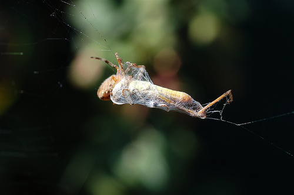

#### David Mills's Internet Shed

Welcome to webshed.org. One of [my](/wiki/About_Me "wikilink") homes on the
internet.

Friends & family that have ended up here are probably lost, anyone
looking for my photos probably wants to be at
[Flickr](http://www.flickr.com/photos/dtl/) instead. Academic visitors
are directed to my [research pages.](/wiki/Research_Interests "wikilink")
Radio amateurs may be interested in my [Ham Radio](/wiki/Ham_Radio "wikilink")
and [Radio Projects](/wiki/Category%3ARadio "wikilink") pages. My radio
callsign is [G7UVW](/wiki/G7UVW "wikilink").  
  
{| style=“width: 80%;padding:1em 1em 1em 1em; border:1px solid \#A3B1BF;
background-color:\#E6F2FF;” valign=“top” border=“1” cellpadding=“2”
cellspacing=“2” align=“center” | colspan=“2” rowspan=“1”
valign=“undefined” | Featured projects and
articles  
  

Some of the more recent things I've been working on and documenting here
on webshed. From photography to electronics via wine and cider making,
I've a wide range of interests. Mature projects and other projects not
actively being worked on at the moment are listed in the [ Projects
Category](/wiki/Category%3AProjects "wikilink") in the menu bar on each
page.  

|- | align=“undefined” valign=“undefined” |

Electronics
-----------

-   [Simple iPod FM transmitter](/wiki/Simple_iPod_Tx "wikilink")
-   [A mercury tuned oscillator (permeability tuned
    oscillator)](/wiki/Mercury_PTO "wikilink")
-   [Equivalent series resistance meter](/wiki/ESR_meter "wikilink")
-   [Making a cheap Chinese 1.8" TFT LCD module
    work](18tftbreakout "wikilink")  
      

Photography
-----------

-   [A long term pin-hole photography project](/wiki/Solargraphy "wikilink")

| align=“undefined” valign=“undefined” |

Radio
-----

-   [ Kelvedon Hatch Secret Nuclear Bunker amateur radio
    station](/wiki/GB0SNB "wikilink")
-   [ Using a FUNcube Dongle SDR reciever under
    Linux](/wiki/FUNcube-Dongle-Linux "wikilink")
-   [144 MHz QRP QRSS transmitter](/wiki/QRSS_2m "wikilink")
-   [ Yaseu FT290R Audio Fix](/wiki/FT290-Audio "wikilink")
-   [ 80m band RX using only PNP transistors](/wiki/PNP-80 "wikilink")  
      

Useful Information
------------------

-   Some information on various [TOKO Coils](/wiki/TOKO_Coils "wikilink") and
    transformers.

|}

<table style="width:10%;">
<colgroup>
<col width="10%" />
</colgroup>
<tbody>
<tr class="odd">
<td>
Some recent photographs 
 
I take photographs from time to time, here are a few I'm particularly pleased with.

 
<strong>Posts on a pier in Barking</strong> 
<flickr>481859844|-|frame|center|This photo was runner-up on the 2011 Thames21 photographic competition</flickr>

 
<strong>Cam 1 : 10:54 2011/01/09 : 20:10 2011/06/21</strong> 
<flickr>5857892496|-|frame|center|A Solargraph taken over 6-months in my garden</flickr>

 
 
<strong>Cam 3 : Exact time and date unknown, somewhere around early February 2011 : 2011/06/19</strong> <flickr>5854384908|-|frame|center|Another Solargraph, the beer-can camera recording this scene was pointing out of a window towards Tower Bridge in London.</flickr> 
 
<strong>A grasshopper about to become lunch</strong> ''Nikon D50 / Nikon 18-55mm ''
</td>
</tr>
</tbody>
</table>

