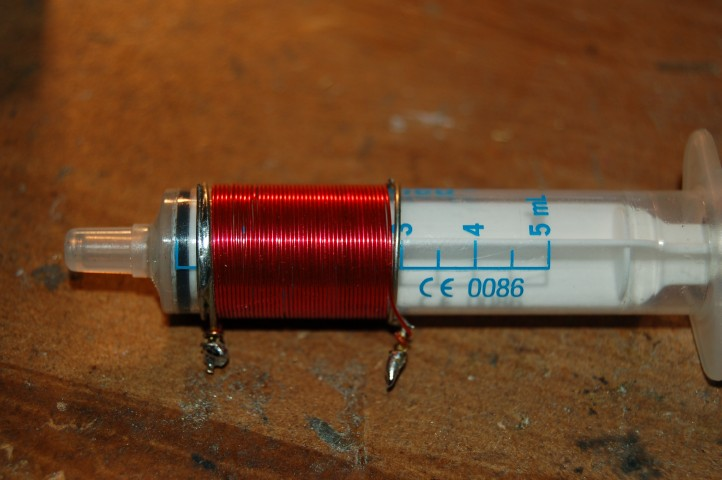
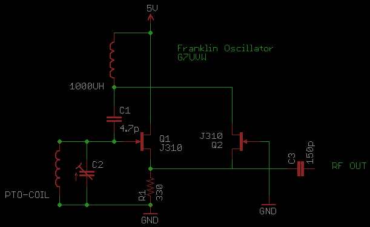
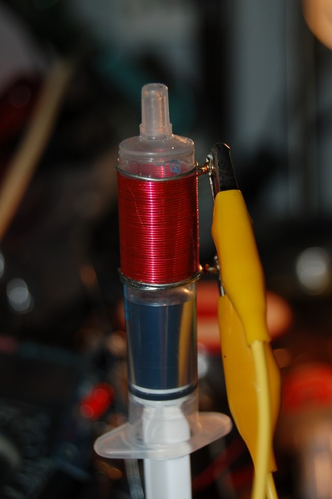

A silly idea - a mercury tuned oscillator!
------------------------------------------

Some time ago I started to build Steve Webber's
[MMR40](http://kd1jv.qrpradio.com/ARRLHBC/ARRL_MMR40.html) radio, which
uses a PTO (permeability tuned oscillator). I got the PTO working and
then thought about ways to improve it before I finished building the
rig.

At the time I had access to some very finely graduated syringes and I
pondered a plunger type tuning arrangement for the PTO. The frequency
could then be read off the graduations of the syringe.

I wound a coil on a cheap plastic 5ml syringe from the lab and measured
the inductance with the syringe empty and with it full of water,
saturated NaCl and saturated CuSO4 solutions. No significant change in
inductance was measured, but I made a note to try mercury should I me
able to obtain some. Being a metal, mercury should have some noticeable
effect and being liquid at normal temperatures it will work nicely in a
syringe.

I finally obtained enough mercury from broken thermometers and relays to
to out the idea of a mercury PTO.

------------------------------------------------------------------------

### The Coil

 The coil used in all these
experiments is 42 turns on a 15mm OD polythene syringe body. There is
nothing “magic” about these values, the number of turns is just enough
to fill half the available space, leaving some clear viewing space to
see how full the syringe is.

------------------------------------------------------------------------

### The Oscillator

A recent article by George Dobbs G3RJV introduced me to the Franklin
Oscillator using a pair of J-FETs in astable coupling with a tuned
circuit to set the oscillation frequency. It seems a fool proof design,
even with my oscillation killing skills I managed to get it to work
first try. 

------------------------------------------------------------------------

### Results

With the syringe empty, the oscillator ran at 4.886 MHz and its
inductance was 11.8 uH. Half filling the syringe and keeping the mercury
below the coil raised the oscillation frequency to 4.892 MHz. With just
enough mercury to completely fill the volume of the coil, the
oscillation frequency increased to 7.565 MHz.

The syringes I used didn't allow for much in the way of fine control, so
I don't have any repeatable data for fractional fillings of the coil
volume, and hence measurements of tuning linearity.

To assess the effect mercury has on the Q of the coil (a question asked
by VK2ZAY on twitter), I resonated the coil both empty and mercury
filled with an 11pF ceramic capacitor (bench sweeping) and swept the
circuit with my mRS miniVNA.

With the coil empty, the circuit formed a notch filter at ~14 MHz with a
3dB bandwidth of 1363.3 kHz and a Q of 10.

Filling the coil with mercury raised the centre frequency of the filter
to 20.4 MHz and reduced the bandwidth to 390 kHz improving the Q to 22.

