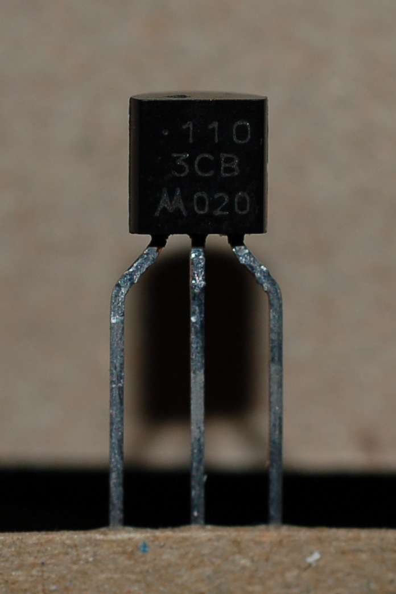
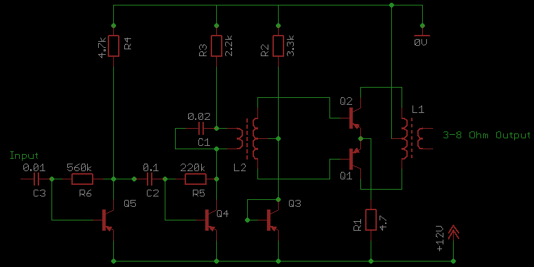
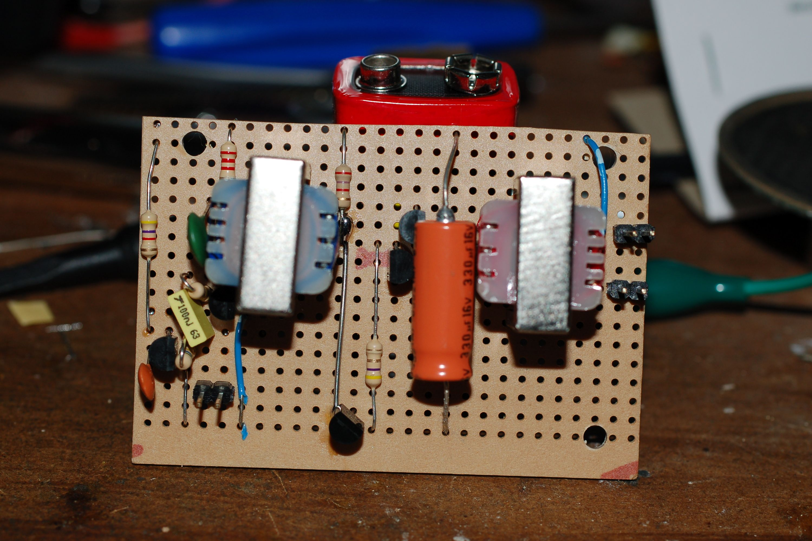
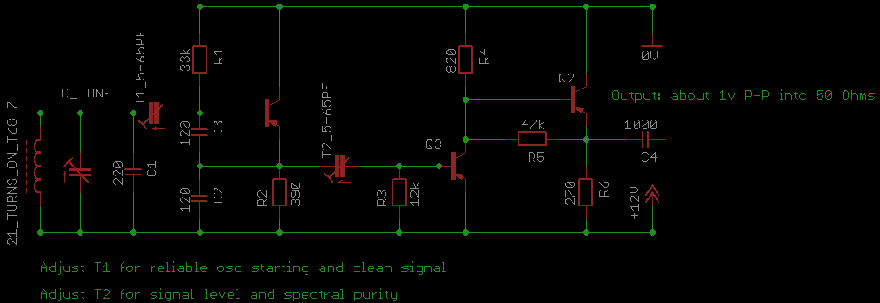
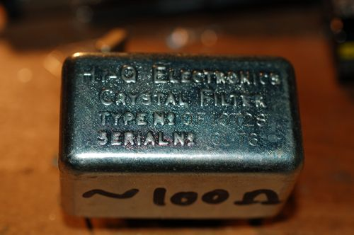
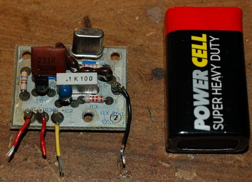

PNP-80 - An 80m band receiver using only PNP transistors
--------------------------------------------------------

The idea for this project came when I bought 200 unknown transistors for
£1 at a radio rally a few years ago. On getting them home I discovered
they were PNP and measured a gain of about 250. I thought it might be
fun to build a radio using just these, then put them away and forgot all
about it for two years.

They have a Motorola logo and part number, but no datasheet I've found
seems to match these parts. Barring more information, I've decided to
use these parts as essentially plastic cased PNP BC108 companions.

The 80m band is pretty active at any time and the low frequency requires
very little from components in a receiver, this is especially suited
when you know almost nothing about the parts you've set out to build
with.

------------------------------------------------------------------------

**Audio Amp**  
If you build a radio backwards, starting at the audio end and working
back towards the antenna, then even if nothing else works, you should at
least have a working audio amplifier; and many of the other radio stages
can be tested by listening to the output and tuning for maximum noise.
The design I went with is a bog-standard transformer coupled Class-B
amplifier, with a bit of biasing on the base of the pull-pull pair to
reduce cross-over distortion. The biasing comes about from the voltage
divider formed from R2 and Q3 acting acting as a diode, this puts about
0.7v on the bases of Q1 and Q2. L2 is an LT44 L1 is an LT700

Built on a scrap of Veroboard, it looks something like this.

------------------------------------------------------------------------

**VFO & Buffer**  
The first attempt at a VFO was a Vackar type design, with which I had
only minor success (it briefly oscillated once). Alan Yates offered up
this [design](http://www.vk2zay.net/article/file/1187). I changed the
buffer for a two transistor job and replaced the coupling capacitors
with trimmers to enable signal purity and level adjustments. Output is
about 1v peak to peak into 50 Ohms.

------------------------------------------------------------------------

**Crystal Filter and Carrier Insertion Oscillator**  
A hunt through the junk box turned up this 10.7 MHz SSB crystal filter
and documentation.
  
It requires a 10.70165 MHz carrier insertion crystal for LSB; another
hunt through the junk produced a 10.8 MHz crystal and an old Pye
Westminster crystal oscillator board.
  
The BC108 on the oscillator board was replaced with one of the PNP
transistors and the crystal was swapped. A bit of inductance added in
series with the crystal brought the frequency down to 10.702MHz - close
enough for the moment.
