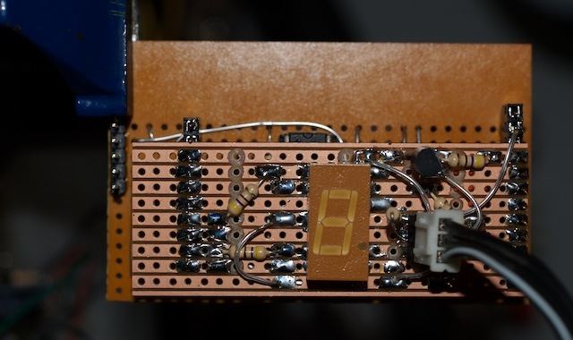

144 MHz QRSS Beacon / MEPT
--------------------------

A rally purchase earlier in 2010 turned out to be a telemetry or data
transmitter on 160-ish MHz. The interesting part of the board was the
12x frequency multiplier and PA.

The RF section of the board has four connections to the digital section.
These include +5v for the oscillator and frequency multiplier, a second
+5v supply for the PA transistor, a modulation input and a signal to
switch on or off the first frequency tripler to kill the RF output
without stopping the oscillator. Ground is common to both sections of
the board.

Conversion to 144 MHz was surprisingly easy; the oscillator crystal was
swapped for a 12 MHz computer grade part and wired in series with a
10-60pF trimmer cap to allow fine frequency adjustment. From then on it
was just a case of peaking the sections of the frequency multiplier and
adjusting the filter for lowest harmonic levels.

The initial power output was rather low (&lt;10mW into 50Ohm), so I took
advantage of the separate PA supply and increased the PA transistor
voltage to 8v; this brought the output up to a more respectable 100mW at
the expense of increased harmonics. Adjustment for minimum harmonics
brought the signal at 144 MHz down to 75mW with all but the 3rd
harmonics at least 30dB below this.

For initial tests, the carrier is just keyed on and off (5s on, 3s off)
with a 555 timer on the tripler control line.

First Light
-----------

First on-air signal report was from M1GEO at the astounding distance of
2.5 miles.
  
Later on, Colin G6AVK had a listen and captured my signal drifting a
little.
  

Frequency stability modification
--------------------------------

Although crystals are usually considered pretty stable frequency
sources, there is a correlation of oscillation frequency with
temperature, a few degrees C temperature change can easily translate
into a hundred Hz or more of frequency shift; indeed, this is the basis
for some thermometers. In this application I'm multiplying up the
crystal frequency, so I also multiply up any shifts due to heating or
cooling of the crystal, 100 Hz shift at 12 MHz becomes 1.2 kHz at 144
MHz, which is way beyond the nominal 100Hz band claimed by QRSS. A means
of keeping the crystal at a constant temperature is required.  
A trawl around eBay brought up a heating clip for a crystal, this passes
a small amount of current though a Positive Temp Coefficient Thermistor,
causing self heating and a positive resistance change that limits the
current though the PTC, the result is a pretty stable temperature for a
given voltage across the PTC. At 12v, the heater draws approx 75mA and
settles down to about 65 degrees C.  
With the heater fitted the frequency drifts upwards quite dramatically
for about 60s until the heater settles down, then the frequency
stability is +/- 2Hz with the board sitting in the open on the bench.

A new controller
----------------

In the south east of England there are lots of chirpy signals and
carriers of unidentified nature in the lower portion of the 2m band,
this makes conclusively spotting the on-off keyed carrier generated by
the 555 timer circuit quite hard. To enable easier identification and to
comply with license regulations, my new controller now sends my
call-sign, G7UVW in QRSS3,6, & 10 modes and also periodically sends
“G7UVW VHF QRSS MEPT” in 12 WPM Morse code. A single 7-segment LED
module provides visual indication of them current transmission mode.

The controller was prototyped on two small pieces of veroboard and works
well enough that I'll probably not bother designing a PCB for it.

The source code for the controller can be found
[here.](http://webshed.org/mediawiki/upload/7/7b/QRSS2m-src.zip) It's a
bit of a mess due in part to CCS C's “interesting” take on the C
language and me rushing it to get something working.
