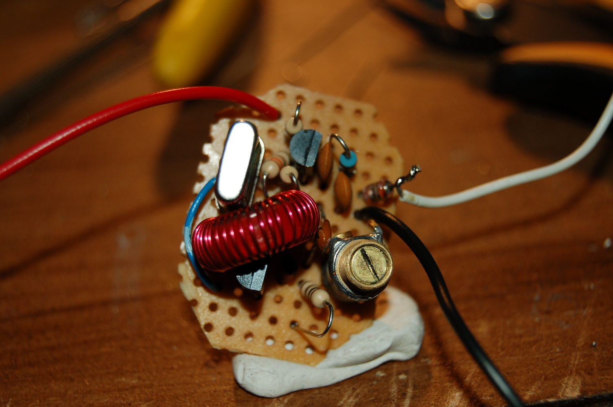
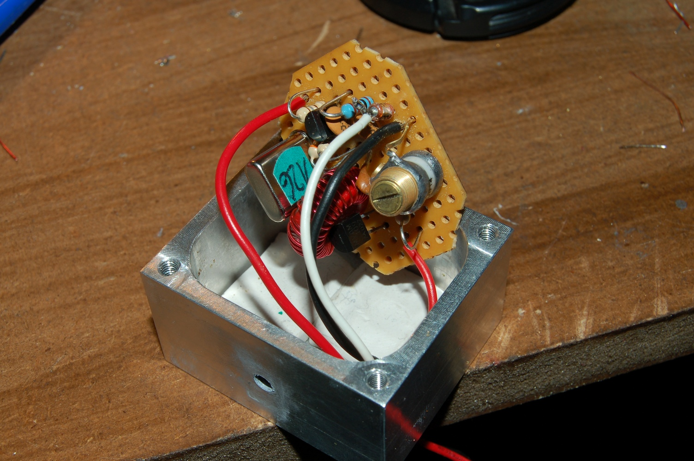

G7UVW QRSS Beacon
-----------------

After seeing lots of information and designs and grabbed QRSS signals
I've decided to have ago at getting a beacon on the air for some tests.
The 10.140 MHz xtal was supplied by Chris G8OCV and the xtal oven was a
rally find a couple of years ago.

**Oscillator**  
The oscillator is pretty much a straight clone of [Hans Summers' junk
box QRSS
beacon](http://www.hanssummers.com/radio/qrssjb/phase1/index.htm) but
with a smaller inductor in series with the xtal and a proper AM radio
varicap (taken from a dead radio) instead of an LED for frequency
shifting.

The whole thing is built on a small scrap of veroboard so that it will
fit inside the aluminum box of my xtal oven. I decided to oven the whole
oscillator instead of just the xtal for better frequency stability.

The white stuff at the bottom of the oven block is white-tak just to
electrically insulate the board from the metal block and hold the board
fairly solidly.

**Oven**  

