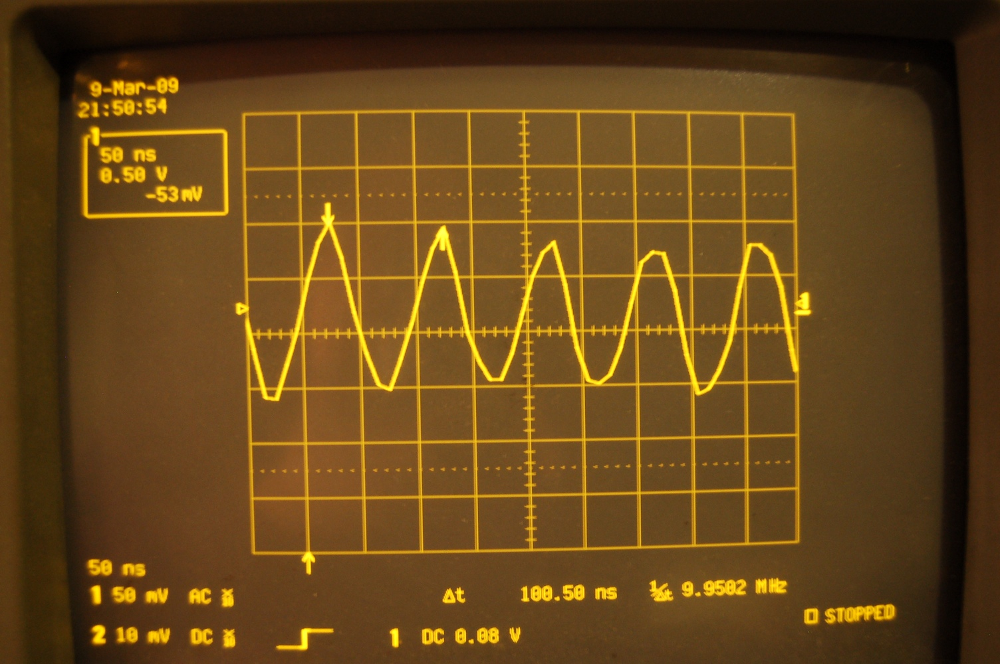
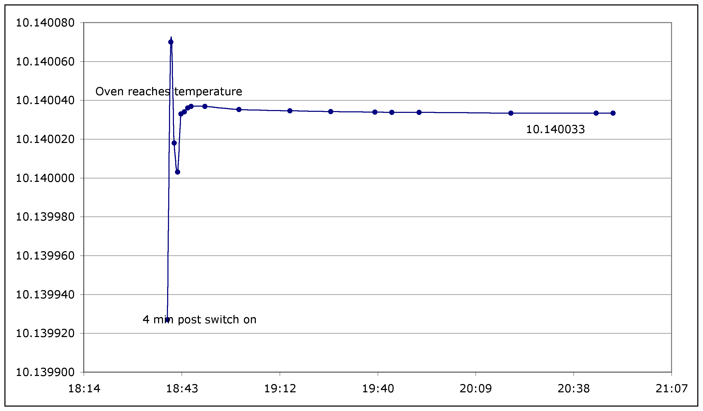
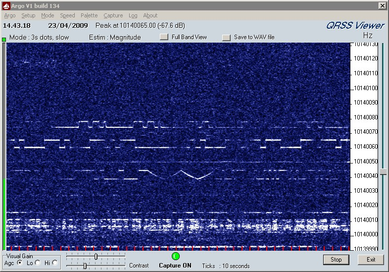

G7UVW QRSS 30 Meter Beacon 10.140 MHz
-------------------------------------

After seeing lots of information and designs and grabbed QRSS signals
I've decided to have ago at getting a beacon on the air for some tests.
The 10.140 MHz xtal was supplied by Chris G8OCV and the xtal oven was a
rally find a couple of years ago.

**Oscillator**  
The oscillator is pretty much a straight clone of [Hans Summers' junk
box QRSS
beacon](http://www.hanssummers.com/radio/qrssjb/phase1/index.htm) but
with a smaller inductor in series with the xtal and a proper AM radio
varicap (taken from a dead radio) instead of an LED for frequency
shifting.

The whole thing is built on a small scrap of veroboard so that it will
fit inside the aluminum box of my xtal oven. I decided to oven the whole
oscillator instead of just the xtal for better frequency stability.

The white stuff at the bottom of the oven block is white-tak just to
electrically insulate the board from the metal block and hold the board
fairly solidly.

**Oven**  
The xtal oven I'm using is an old Pye ovened frequency standard. I think
I paid about £3 for it at a radio rally. It wasn't a 10MHz standard as
I'd hoped and a straight xtal swap didn't work with the existing
oscillator, so it was replaced with a 10MHz rubidium standard from ebay.
After sitting unused for some time on the shelf, it has been re-purposed
for this project.

The oven itself is just a box fitted with two BD132 transistors as
heaters. There is a simple 741 based circuit that compares a thermistor
and a potentiometer and adjusts the transistor current to heat the box
and thermistor. Temperature control is pretty good after about a 20min
warm up.

**First ~~light~~ RF**  
Fed with 8 volts from the internal supply of the oven, the oscillator
starts up at 10.140240 MHz and drifts downwards to 10.140105.3 as the
oven heats up. This final frequency holds stable to within 0.1 Hz for at
least 3 hours.  

The signal from the oscillator isn't a pure sinewave, so there is some
need for bandpass filtering to remove harmonics before this goes on air.

------------------------------------------------------------------------

*Update 10/03/2009*

I removed the old buffer stage from the Pye frequency standard and
replaced it with a single 2N2222 buffer. The Pye stage was probably
better designed, but was also somewhat filtered thus reducing the power
out at 10.140 MHz. A simple low pass filter has been fitted to the
output and I now get something that looks closer to a sine wave.  
Measured power out into a 50Ohm load is 800uW. Initial start up
frequency is around 6.8 MHz !, rapidly rising at the oven heats up to
around 10.3 MHz before settling down at a steady 10.140031 MHz. No idea
why the oscillator starts so low, but you can watch it increase in
frequency by ~100KHz per second until it jumps to 10.139xxx MHz and then
settles.

------------------------------------------------------------------------

*Update 11/03/2009*

The warm up and settling of the oscillator. The 6MHz start up is omitted
to allow the scale to show deviations around 10.140 MHz

------------------------------------------------------------------------

*Update 11/03/2009*

The low start up frequency problem seems to have cured itself, the
oscillator now starts around 10.139 MHz and shortly settles at
10.1400035 MHz.

The oscillator feeds a small PA to provide about 2.8W into a 50ohm load
(with PA supply at 12v). The output of the PA is bandpass filtered with
a couple of retuned 10.7 MHz TOKO IF cans which also limit the power
output to 13mW into 50ohm (PA supply at 8v). Photographs to follow. On
air test to happen in next day or two.

------------------------------------------------------------------------

*Update 21/04/2009*

The onair test occured, but I'm not 100% sure my signal was seen on the
QRSS grabbers. A simple [PA stage using a 74HC244
IC](74hc244-PA "wikilink") has been designed to increase the power
output of the beacon.

------------------------------------------------------------------------

*Update 23/04/2009*

Success! Had a play with the filters on the output last night with the
help of Chris G8OCV. Now putting about 200mW into a known crap antenna.
Spotted signal on I2NDT's grabber in Bergamo Italy.

The sawtooth pattern in the middle of the screen with some faint Morse
either side is my signal.
