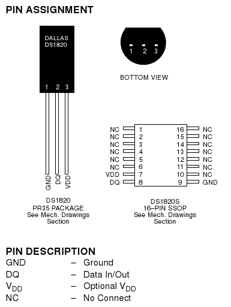

How to use DS18x20 1-wire temperature sensors with the Raspberry PI
-------------------------------------------------------------------

The Raspberry PI (rPI) has several different serial buses brought out on
its GPIO (General Purpose Input/Output) pins, including SPI and
I2C, however there is no 1-Wire interface. Luckily, in modern
Linux Kernels there is a driver module for bit-banging a 1-Wire
interface using a single GPIO pin. In recent [Raspbian
“wheezy”](http://www.raspbian.org/) releases GPIO-4 is the pin used. The
rest of this article will describe how to use this module and connect
DS18x20 series 1-Wire temperature sensors to the rPI.  
I built my breakout interface directly onto a plastic pin header for
testing purposes, but this is hardly the best way to do it.  

------------------------------------------------------------------------

Hardware
--------

  
To interface a DS18x20 sensor to the rPI, the bare minimum hardware you
need is a single 4.7K resistor, the DS18x20 sensor and a plug that will
fit the rPI GPIO pins. The wiring diagram is show below, along with a
some photographs of the parts I soldered together for this experiment. I
used a now-obsolete DS1820 sensor, but modern Ds18s20 and DS18b20 will
work the same way (and offer more features and more precise temperature
readings).

I built my breakout interface directly onto a plastic pin header for
testing purposes, but this is hardly the best way to do it.  
  

<File:Fritzing_rPI_DS1820.png%7CCartoon> schematic of DS1820 connections
to a Raspberry PI. <File:RPI-ds1820.jpg%7C1-Wire> interface for
Raspberry PI build on a pin-header. <File:RPI-DS1820.jpg%7CInterface>
mounted on Raspberry PI GPIO pins

Software
--------

The 1-Wire drivers are not loaded by default when the rPI boots. You can
load them with the following commands from a command prompt:  

    pi@raspberrypi:~$ sudo modprobe wire

    pi@raspberrypi:~$ sudo modprobe w1-gpio

    pi@raspberrypi:~$ sudo modprobe w1-therm 

Connect the sensor hardware to the rPI and check it is detected by
seeing if a device is listed on the 1-Wire bus.

    pi@raspberrypi:~$ cat /sys/bus/w1/devices/w1_bus_master1/w1_master_slave_count

    1 

This will print the number of sensors detected, 1 - for my hardware at
the moment. You can get the sensor ID (a hexadecimal string stored in
ROM on the sensor chip) by reading the w1\_master\_slaves file:

    pi@raspberrypi:~$ cat /sys/bus/w1/devices/w1_bus_master1/w1_master_slaves

    10-00080234149b 

A quick check for correct operation of the sensor is to “read” the
sensor file, you'll need the hex ID of the sensor from earlier commands

    pi@raspberrypi:~$ cat /sys/bus/w1/devices/10-00080234149b/w1_slave

    37 00 4b 46 ff ff 07 10 1e&nbsp;: crc=1e YES

    37 00 4b 46 ff ff 07 10 1e t=27312 

The number after 't=' is the temperature in mili-degrees Celsius.

Unfortunately, at the time of wiring this article (December 2012) the
very useful [OWFS](http://owfs.org/) (OneWire File System) software is
incompatible with the w1-gpio kernel drivers, so you can't yet use the
nice owfs tools to explore and retrieve data from sensors connected to
the rPI this way.

  

Archiving and graphing temperature readings with RRDtool
--------------------------------------------------------

To make the sensors useful you really want more than a single reading,
you want a time series, and some way to investigate the data you
collect. RRDtool is designed for just this type of thing. It's a
database you can put temperature readings into, and a graphing program
that can present the readings in interesting ways.

This is how Ive set up RRDtool to log the temperature every five minutes
and produce hourly, daily, weekly, monthly and yearly graphs.

First off you need RRDtool installed:  

    sudo apt-get install rrdtool

Then create the initial database to store readings in  

    pi@raspberrypi:~/rrdtool create rPItemp.rrd --step 300 \
    DS:temp:GAUGE:600:-30:50 \
    RRA:AVERAGE:0.5:1:12 \
    RRA:AVERAGE:0.5:1:288 \
    RRA:AVERAGE:0.5:12:168 \
    RRA:AVERAGE:0.5:12:720 \
    RRA:AVERAGE:0.5:288:365

This creates a database with a base data interval of 5m (300s), with a
data range of -30 to +50 (degrees C), and some calculated averages for
hour, day, week, month and year. The [RRDtool documentation
& examples](http://oss.oetiker.ch/rrdtool/doc/rrdcreate.en.html) was my
source for this.  

Extra stuff
-----------

<Category:Experiments> <Category:Computer> <Category:Electronics>
<Category:RaspberryPI> <Category:HowTo>
