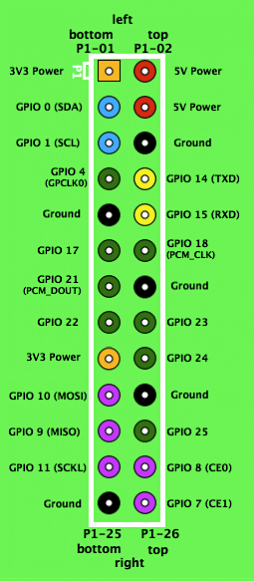

How to use the DS1820 / DS18s20 / DS18b20 with the Raspberry PI
---------------------------------------------------------------

So you've got a shiny new rPI and want to connect it to some sensors -
the 1-wire bus is a good way to do so. A bunch of devices can be
connected to just three pins on the rPI GPIO connector.

For this example I'm connecting a temperature sensor, a DS1820 (but the
configuration is identical for other parts in the same series: DS18s20 &
DS18b20) to the +3.3V, GND and GPIO-4 pins on the GPIO connector.

