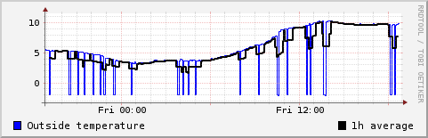
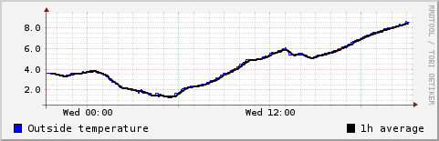

Multiple DS18x20 1-wire sensors on the Raspberry PI
===================================================

“Edited 22/12/2013 to add a link to github” *Edited 1/1/2013 to fix
buggy code, etc*

In a [previous article](/wiki/RaspberryPI_DS1820 "wikilink") I showed how to
use a 1-wire temperature sensor with the Raspberry PI with minimal
interface requirements. The nice thing with 1-wire sensors in that
multiple devices can share the same bus. You just wire the sensors in
parallel - all GND pins tired together, all DQ pins tied together and
all VCC pins (if you use them) tired together.  
The perl code developed for the previous article can only access a
single sensor. To read multiple sensors we need to fist get the device
IDs of all sensors on the bus, then read each sensor's data.  
On the rPI using the w1 kernel drivers, the file
“**/sys/bus/w1/devices/w1\_bus\_master1/w1\_master\_slaves**” contains a
list of all the device IDs detected on the 1-wire bus. We can read this
to get a list of IDs to iterate over, requesting data from each of
them.  

    #!/usr/bin/perl
    use strict;
    use warnings;

    &amp;check_modules;
    &amp;get_device_IDs;

    my $in_correction = 6.0;
    my $out_correction = 2.1;
    my $count = 0;
    my $reading = -1;
    my $device = -1;
    my @deviceIDs;
    my @temp_readings;

    foreach $device (@deviceIDs)
    {
        $reading = &amp;read_device($device);
        if ($reading == 9999) {
           $reading = "U";
        }
                
        push(@temp_readings,$reading);
              
    }

    if ($temp_readings[0] ne 'U') {$temp_readings[0] -= $in_correction;}
    if ($temp_readings[1] ne 'U') {$temp_readings[1] -= $out_correction;}

    #update the database
    `/usr/bin/rrdtool update  /home/pi/temperature/multirPItemp.rrd N:$temp_readings[0]:$temp_readings[1]`;
    print "Temp 1 = $temp_readings[0]    Temp 2 = $temp_readings[1]\n";

    sub check_modules
    {
       my $mods = `cat /proc/modules`;
    if ($mods =~ /w1_gpio/ &amp;&amp; $mods =~ /w1_therm/)
    {
     #print "w1 modules already loaded \n";
    }
    else 
    {
    print "loading w1 modules \n";
        `sudo modprobe w1-gpio`;
        `sudo modprobe w1-therm`;
    } 
    }

    sub get_device_IDs
    {
    # The Hex IDs off all detected 1-wire devices on the bus are stored in the file
    # "w1_master_slaves"    

    # open file
    open(FILE, "/sys/bus/w1/devices/w1_bus_master1/w1_master_slaves") or die("Unable to open file");
     
    # read file into an array
     @deviceIDs = &lt;FILE&gt;;
     
     # close file 
     close(FILE);
    }

    sub read_device
    {
        #takes one parameter - a device ID
        #returns the temperature if we have something like valid conditions
        #else we return "9999" for undefined

        my $deviceID = $_[0];
        $deviceID =~ s/\R//g;
     
        my $ret = 9999; # default to return 9999 (fail)
       
        my $sensordata = `cat /sys/bus/w1/devices/${deviceID}/w1_slave 2&gt;&amp;1`;
        print "Read: $sensordata";

       if(index($sensordata, 'YES')&nbsp;!= -1) {
          #fix for negative temps from http://habrahabr.ru/post/163575/
          $sensordata =~ /t=(\D*\d+)/i;
          #$sensor_temp =~ /t=(\d+)/i;
          $sensordata = (($1/1000));
          $ret = $sensordata;
       } else {
          print ("CRC Invalid for device $deviceID.\n");
       }

       return ($ret);
    }

This perl code writes data to a RRD database with two sensors - it
should be pretty straightforward to extend this to any number of
sensors.  
The RRD database is created with this script  

    #!/bin/bash
    rrdtool create multirPItemp.rrd  --step 300 \
    DS:in_temp:GAUGE:600:-30:50 \
    DS:out_temp:GAUGE:600:-30:50 \
    RRA:AVERAGE:0.5:1:12 \
    RRA:AVERAGE:0.5:1:288 \
    RRA:AVERAGE:0.5:12:168 \
    RRA:AVERAGE:0.5:12:720 \
    RRA:AVERAGE:0.5:288:365

The graphs are generated every five minutes from a cron job with with
this script  

    #!/bin/bash
    RRDPATH="/home/pi/temperature/"
    RAWCOLOUR="#FF0000"
    TRENDCOLOUR="#0000FF"
    #hour
    rrdtool graph $RRDPATH/mhour.png --start -6h \
    DEF:intemp=$RRDPATH/multirPItemp.rrd:in_temp:AVERAGE \
    DEF:outtemp=$RRDPATH/multirPItemp.rrd:out_temp:AVERAGE \
    CDEF:intrend=intemp,1200,TREND \
    CDEF:outtrend=outtemp,1200,TREND \
    LINE2:intemp$RAWCOLOUR:"Inside temperature" \
    LINE1:intrend$TRENDCOLOUR:"20 min average" \
    LINE2:outtemp$RAWCOLOUR:"Outside temperature" \
    LINE1:outtrend$TRENDCOLOUR:"20 min average"

    #day
    rrdtool graph $RRDPATH/mday.png --start -1d \
    DEF:intemp=$RRDPATH/multirPItemp.rrd:in_temp:AVERAGE \
    DEF:outtemp=$RRDPATH/multirPItemp.rrd:out_temp:AVERAGE \
    CDEF:intrend=intemp,1800,TREND \
    CDEF:outtrend=outtemp,1800,TREND \
    LINE2:intemp$RAWCOLOUR:"Inside temperature" \
    LINE1:intrend$TRENDCOLOUR:"1h min average" \
    LINE2:outtemp$RAWCOLOUR:"Outside temperature" \
    LINE1:outtrend$TRENDCOLOUR:"1h min average"

    #week
    rrdtool graph $RRDPATH/mweek.png --start -1w \
    DEF:intemp=$RRDPATH/multirPItemp.rrd:in_temp:AVERAGE \
    DEF:outtemp=$RRDPATH/multirPItemp.rrd:out_temp:AVERAGE \
    LINE2:intemp$RAWCOLOUR:"Inside temperature" \
    LINE2:outtemp$RAWCOLOUR:"Outside temperature" \

    #month
    rrdtool graph $RRDPATH/mmonth.png --start -1m \
    DEF:intemp=$RRDPATH/multirPItemp.rrd:in_temp:AVERAGE \
    DEF:outtemp=$RRDPATH/multirPItemp.rrd:out_temp:AVERAGE \
    LINE2:intemp$RAWCOLOUR:"Inside temperature" \
    LINE2:outtemp$RAWCOLOUR:"Outside temperature" \

    #year
    rrdtool graph $RRDPATH/myear.png --start -1y \
    DEF:intemp=$RRDPATH/multirPItemp.rrd:in_temp:AVERAGE \
    DEF:outtemp=$RRDPATH/multirPItemp.rrd:out_temp:AVERAGE \
    LINE2:intemp$RAWCOLOUR:"Inside temperature" \
    LINE2:outtemp$RAWCOLOUR:"Outside temperature" \

This code is now maintained at
[github](https://github.com/g7uvw/rPI-multiDS18x20) Download it from
there, rather then grabbing it by copy & past from this page - that
seems to cause errors with HTML codes getting embedded in the perl code.

The perl code as originally written didn't deal with bus drop-out
glitches at all (sometimes the 1-wire driver can't read the device, or
the device doesn't respond in time) so the graphs would end up corrupt
with invalid data. The graph below shows the sort of thing you'd see
when corrupt data was stored.

[George Smart](http://george-smart.co.uk)was kind enough to allow
himself to be volunteered into fixing my, frankly terrible, perl code.
It has been about a decade since I'd writtten anything in perl, and had
forgotten most of what I knew. He kept the basic outline of my original
code and just made it work as I intended it. He is a bloody decent chap!

The new code is now what is gracing the top of this page.

Now the results look more like this.

<Category:Experiments> <Category:HowTo> <Category:RaspberryPI>
<Category:Projects> <Category:Electronics>
