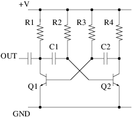

A simple signal injector for troubleshooting radio receivers
------------------------------------------------------------

A signal injector is a low power oscillator that generates a signal and
lots of harmonics in the audio and low frequency RF spectrum. This
allows you to test both the audio and RF stages of a radio receiver.
They are very simple to built and every work bench should have one.

#### The circuit

The basic circuit for for signal injector is an Astable Oscillator - two
transistors configured to alternately switch the state of the other
transistor. 

The oscillator's operating frequency is set by R2, R3 and C1 & C2.

$f = \\frac{1}{T}

= \\frac{1}{\\ln(2) \\cdot (R\_2 C\_1 + R\_3 C\_2)}

\\approx \\frac{1}{0.693 \\cdot (R\_2 C\_1 + R\_3 C\_2)}$

where...

-   *f* is [frequency](frequency "wikilink") in
    [hertz](hertz "wikilink").
-   *R*2 and *R*3 are resistor values in ohms.
-   *C*1 and *C*2 are capacitor values in farads.
-   *T* is the period (In this case, the sum of two period durations).

The output approximates a square wave with the duty cycle controlled by
the values of R2 and R3. In the case where R2 = R3, the duty cycle is
very close to 50% and the circuit produces a reasonable square wave -
this is not really what we want. A square wave is comprised only of odd
harmonics, ideally we'd like both the odd and even harmonics so that
there is a signal close to wherever the radio is tuned.
