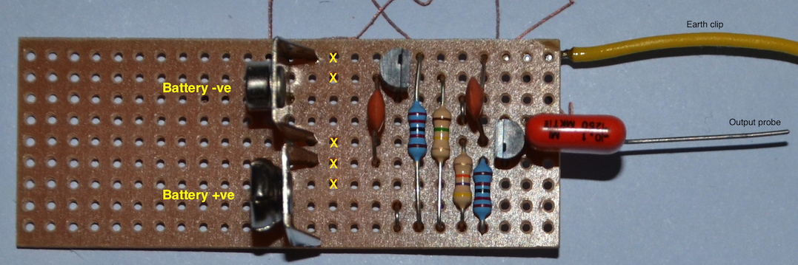

A simple signal injector for troubleshooting radio receivers
------------------------------------------------------------

A signal injector is a low power oscillator that generates a signal and
lots of harmonics in the audio and low frequency RF spectrum. This
allows you to test both the audio and RF stages of a radio receiver.
They are very simple to built and every work bench should have one.

#### The circuit

The basic circuit for for signal injector is an Astable Oscillator - two
transistors configured to alternately switch the state of the other
transistor. 

The oscillator's operating frequency is set by R2, R3 and C1 & C2.

$f = \\frac{1}{T}

= \\frac{1}{\\ln(2) \\cdot (R\_2 C\_1 + R\_3 C\_2)}

\\approx \\frac{1}{0.693 \\cdot (R\_2 C\_1 + R\_3 C\_2)}$

where...

-   *f* is frequency in hertz.
-   *R*2 and *R*3 are resistor values in ohms.
-   *C*1 and *C*2 are capacitor values in farads.
-   *T* is the period.

The output approximates a square wave with the duty cycle controlled by
the values of R2 and R3. In the case where R2 = R3, the duty cycle is
very close to 50% and the circuit produces a reasonable square wave -
this is not really what we want. A square wave is comprised only of odd
harmonics, ideally we'd like both the odd and even harmonics so that
there is a signal close to wherever the radio is tuned.

#### Simulation

Some experimentation with the QUCS circuit simulator suggests reasonable
values for the resistors and capacitors

| Part Number | Value    |
|-------------|----------|
| R1 & R4     | 22k Ohm  |
| R2          | 470k Ohm |
| R3          | 100k Ohm |
| C1          | 10n F    |
| C2          | 10 nF    |

  
You can see from the simulated data that the oscillator output is full
of nice fast rising edges (good for harmonic generation) and does indeed
contain harmonics out to beyond 20 kHz (that's as far as I plotted, the
spectrum continues, but levels are too low to show on this plot). The
low levels at higher frequencies are a good thing, as typically the
circuit you'll be testing with this generator will be sensitive to
tens-to-hundereds of micro-volts; you don't need big signals to test
these circuits.

You can easily prove the circuit generates higher harmonics by building
it and connecting the output to the antenna of an AM radio - you'll hear
a buzzing noise repeating as you tune across the AM band.

#### Building the signal injector

The circuit is easily built on a scrap of veroboard.

The yellow Xs are where the copper strips are cut on the backside.

#### Using the signal injector

This circuit is only to be used on battery powered devices, NOT anything
mains powered. There's no isolation from the mains provided by this
equipment.

The ground clip is connected to ground on the radio receiver, and the
output probe touched to the various stages' inputs, usually working back
towards the antenna from the speaker / headphones. When you stop hearing
a sound, you've found the non-working stage. From there it's a matter of
faultfinding in the stage (usually a duff transistor or capacitor or
broken wire).
