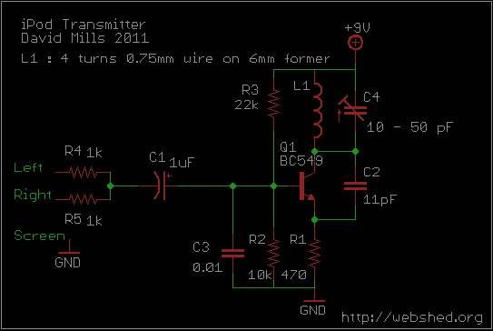
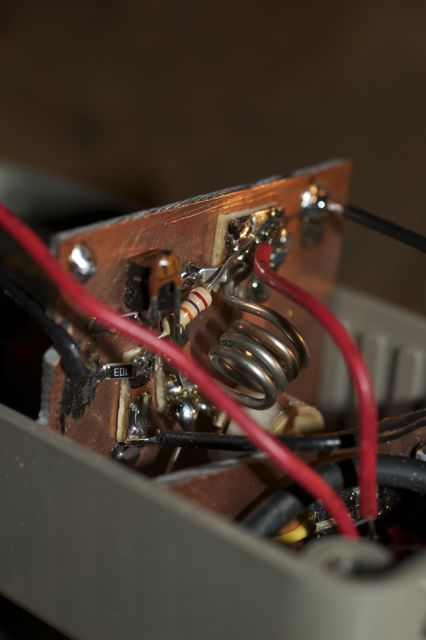
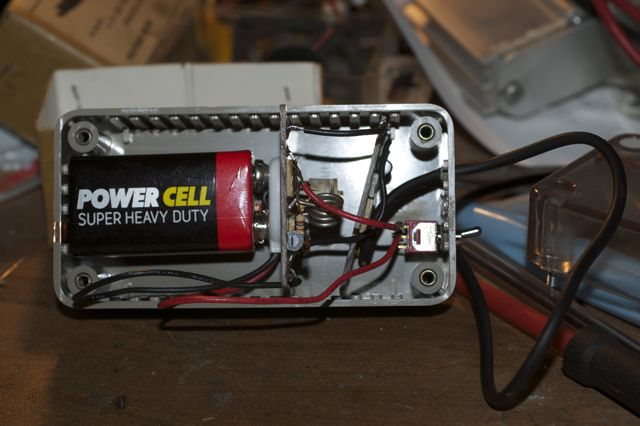
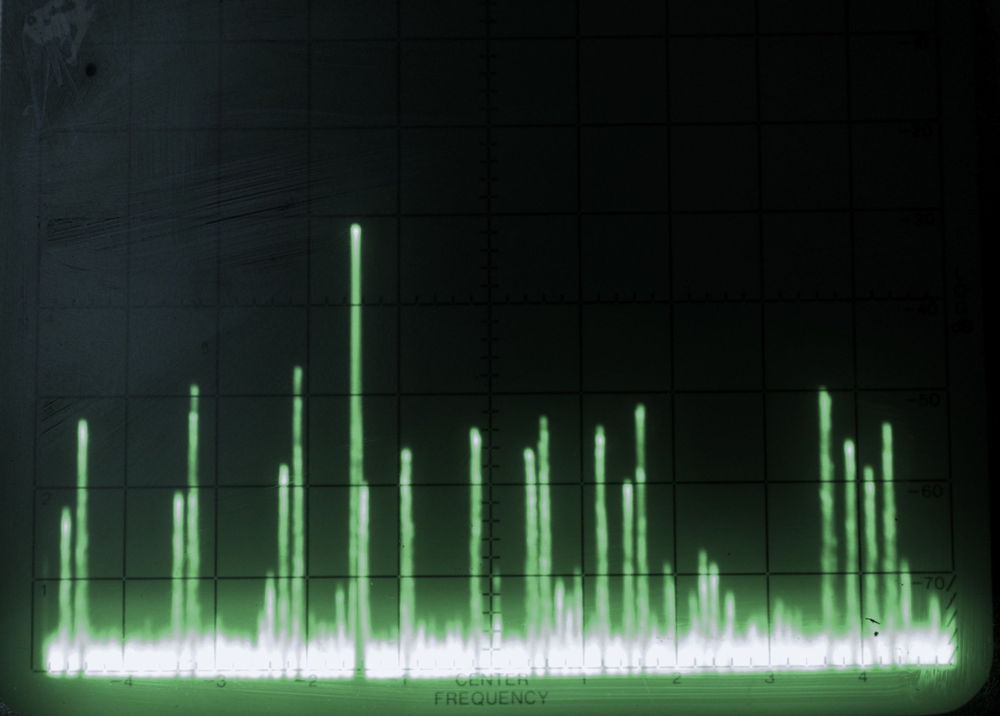

A simple FM transmitter for the iPod & other devices
----------------------------------------------------

A friend wanted to connect her iPod to her home stereo system, but said
stereo doesn't have any external inputs. The simplest solution, avoiding
diving into the wiring in the stereo, is to transmit the audio from the
iPod to the FM radio in the stereo system. This gave me the opportunity
to play with [Tetsuo Kogawa’s MicroFM transmitter
design](http://anarchy.translocal.jp/radio/micro/howtosimplestTX.html)
as featured recently on [Mark VandeWettering's](http://brainwagon.org/)
website.

  
The circuit really is about as simple as it gets, a single transistor is
configured as a free-running L-C oscillator somewhere between 88 - 108
Mhz (the FM broadcast band) and signals on the transistor base changes -
modulates - the oscillator frequency. 

R4 and R5, the pair of 1k resistors in the schematic are just to
passively mix the left and right audio channels from the iPod, producing
a mono signal to drive the transmitter. In this application there is no
major problem with messing with the audio in this way, this isn't
supposed to be a high quality high fidelity device. A stereo FM
transmitter is much more complicated.

I built the circuit on a scrap of FR4 PCB material cut to fit a case I
planned to use. The parts are a mixture of 1206 size surface mount and
standard pin-though-hole parts. I didn't get a photo of the board before
I mounted it in the case. A strip of adhesive backed copper flashing
tape stuck inside the case forms an antenna and increases the
transmitter range from 50cm to around 20m.

The transmitter draws approx 10mA from a 9v supply, so should run for
about 50h from a fresh Zinc Carbon or Alkaline battery. Audio quality is
surprisingly good considering the simple nature of the circuit.

