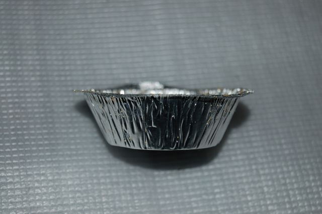

Solargraphy
-----------

*This is a work in progress article*  
Some time ago, Make Magazine featured an
[article](http://blog.makezine.com/archive/2010/02/lovely_solargraphy_photos.html)
regarding pinhole photography of the path of the sun over a six month
period. The article introduced the work of [Tarja
Trygg](http://www.solargraphy.com/), having an interest in photography I
decided to have a go myself.

I had planned to have the cameras ready and in place for the winter
solstice, so I could capture an entire half period of the sun, from
lowest (21 December) to highest (21 June); however I didn't quite manage
to get everything ready in time. The first cameras will hopefully be in
position by the second week of January.

Howto: As far as I understand it...
-----------------------------------

You need four things:

1.  A beer can - you can start with a full one, but it needs to be empty
    to make the pinhole camera, so get drinking.
2.  A tool to cut off the top of the can
3.  Some positive (lit areas go black) photographic paper.
4.  Gaffer / Duct tape.

**Here's how you combine them.**  
1. Empty the beer can. It's worth rinsing it out with clean water now,
else you'll probably spill beer dregs over yourself as you cut the top
off the can.  
2. Using a rotary cutter or scissors or some other tool, remove the top
of the beer can.  
3. It's worth processing several cans at once.

|                                                                                                                                                                             |                                                                                                                                                                  |                                                                                                                    |                                                                                                                                                                                                                                               |
|-----------------------------------------------------------------------------------------------------------------------------------------------------------------------------|------------------------------------------------------------------------------------------------------------------------------------------------------------------|--------------------------------------------------------------------------------------------------------------------|-----------------------------------------------------------------------------------------------------------------------------------------------------------------------------------------------------------------------------------------------|
|  |  |  |  |

  

4. I gave my cans a coat of black spray paint inside, to help kill any
stray reflections, but this is entirely optional and I've no idea if it
is worth actually doing.

5. Make a pinhole about half way down the length of the can. I used a
0.3mm sewing needle, I think this is large enough without being too
large. I'll find out in six months... You'll need to cover the hole with
opaque tape.

6. In a dark room load the paper into the camera. Matt side against the
can walls, shiny side facing in to the can. The paper should be opposite
the pinhole. Don't let the paper cover the pinhole. I did this step in
my dark bathroom with just a red LED on a half dead battery as the only
light. Let your eyes adjust to the light before you start this step.

7. As soon as the camera is loaded, cover up the open end with gaffer
tape. You want it light tight. Don't be afraid to use more tape.  
**Update:** This step is hard to do in the dark, the tape is about the
same width as the hole in the can. A better idea would be to use an
Aluminium pie case, which pushes in to the hole and makes a snug fit.
This is then easily taped into place.

|                                                                                                               |                                                                                                                                                        |                                                                                                                                                                                                                                                                                                        |
|---------------------------------------------------------------------------------------------------------------|--------------------------------------------------------------------------------------------------------------------------------------------------------|--------------------------------------------------------------------------------------------------------------------------------------------------------------------------------------------------------------------------------------------------------------------------------------------------------|
|  |  |  |

Exposure
--------

Secure the camera to something solid, and in a place where it is
unlikely to attract unwanted attention (remember, you want it in the
same place for 6 months). Facing south if you want to trace the path of
the sun. Pull off the tape covering the pinhole, make a note of the date
and time and start waiting and wondering.

If all goes well, then the size of the pinhole and the ludicrous
quantities of gaffer tape sealing the camera should work to keep the
worst of the weather out of the camera body and away from your
photographic paper. If not, well, it's Art and you meant for it, right?

Developing
----------

To be added when I experiment with developing my cameras.

Results
-------

Cam 1 : 10:54 2011/01/09 Cam 2 : 13:00 2011/01/24
{{\#display\_map:{51.518264,-0.002607}|zoom={19}|service={googlemaps}}}
