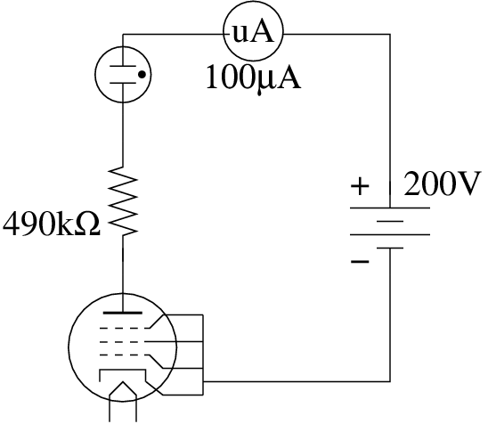

Some experiments with vacuum tubes
----------------------------------

I've wanted to build a radio (either RX or TX) with a vacuum tube or
two. This page will document my attempts at getting familiar with this
old technology.

##### The basics

Looking in my collection of tubes, I had a bunch of common types to pick
from for experiments, most being pentodes. I hoped that ignoring the
grids (leaving them floating) while putting some volts between Anode and
Cathode would cause a current to flow when the filament was lit. I tried
this with the couple of EF91s I had in the collection with no results;
it's possible the tubes are dead.

The other tube type I had a few new old stock (never used, still in
original packaging) were EF86 low noise audio amplifier pentodes. Again
leaving the grids floating didn't let any current flow though the tube,
however unlike the EF91s I tried, grounding the grids did cause a
current to flow.

The resistor and neon combination limit anode current to around 50 µA.
If the HT is switched on before the heater voltage, the current slowly
climbs as the cathode is heated and begins emitting electrons. The neon
starts to glow before the meter needle even starts to move. The voltage
measurements at various points in the circuit look reasonable, though I
was surprised with the large voltage drop across the tube, I'd expected
it to be lower resistance than the anode resistor. This may be an effect
of the grounded grids.

| Circuit node         | Voltage (V) |
|----------------------|-------------|
| Vpsu      | 208         |
| Vresistor | 21.3        |
| Vneon     | 56.2        |
| Vtube     | 123.3       |

This circuit was lashed together on the bench with crocodile clips
connecting to the tube pins. I'll need some proper bases before I can
try to make the valves do my bidding - crocodile clips are a bit
cumbersome to say the least.
