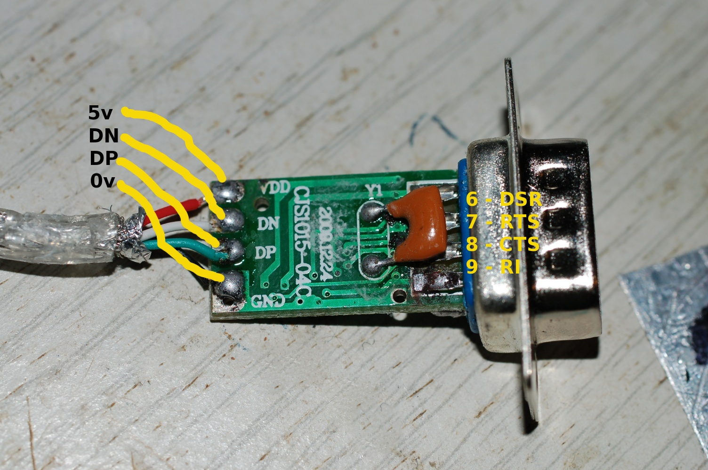
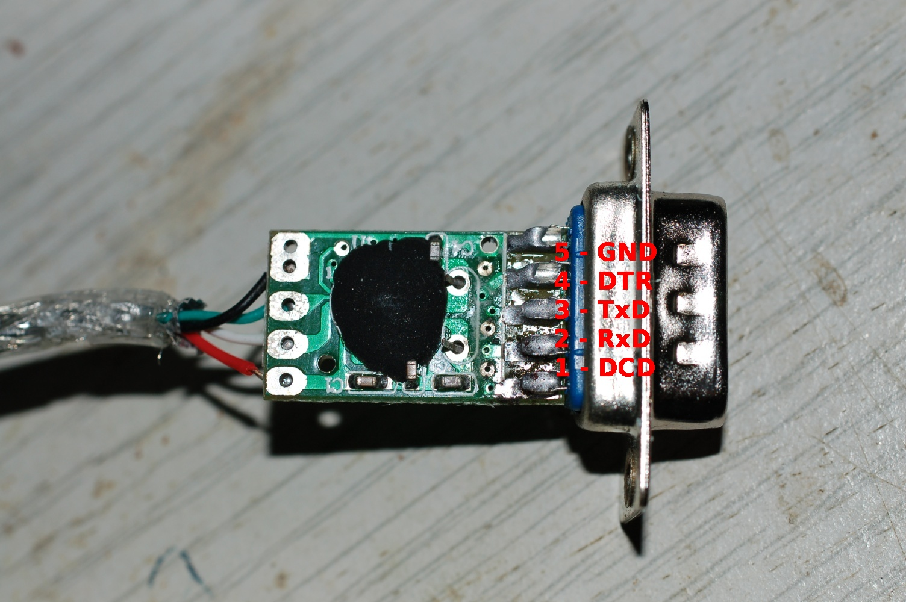

A simple USB digi-modes radio interface
---------------------------------------

*Work in progress* I've been wanting to try out digital modes on the HF
and VHF bands for some time, receiving is easy - you just need a
connection between the radio and the computer's soundcard line-in port.
Transmission is a little more complex, depending on both the radio used
and the software on the computer. You often have the option of either
feeding data from the soundcard to the radio's mic socket and using an
RS232 serial port to control the PTT line, or doing all the data
transmission via the serial port and only using the soundcard for
reception. There are various DIY and commercial designs for both types
of interface, this page documents my version built for as little money
as possible using parts from eBay and the poundshop.

I want an entirely self contained interface, one USB connection to the
computer and the necessary connections to the radio. To achieve this I
need at least three things, a USB hub, a USB soundcard and a USB to
RS232 converter. A quick trawl though eBay turned up the soundcard and
the RS232 adaptor. 

  
The USB-serial converter was the first item to arrive, it uses a
Prolific chipset instead of the more common FTDI parts. “Carefully”
removing the soft plastic enclosure revels a small PCB about 10x15mm.
The connections are shown in the next two images. I will de-solder the
D-connector and the USB cable to leave a small board that can be
integrated into the design with minimal wasted space. When I have all of
the parts, I'll probably design a PCB to mount them all on.

