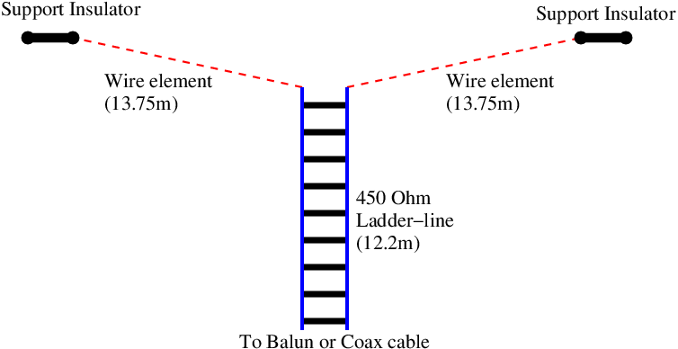

ZS6BKW wire antenna
-------------------

**Some background**  
When looking for a good multi-band HF antenna to erect at home, I
initially looked at the G5RV wire antenna; it is often claimed as a
match-anywhere general purpose HF antenna. Further research reveled that
it was never intended to be multi-band, and had only relatively recently
been 'sold' as such. An antenna that does perform how the G5RV is
claimed to perform is the variant invented by It was derived by Brian
Austin ZS6BKW (now G0GSF). It's essentially a shorter G5RV with improved
matching network. With some care in building and siting, it can give
excellent results on all bands from 80m to 6m (excluding 30m and 15m,
though a good ATU will easily load the antenna on these bands too).

  
**The design**  
The ZS6BKW uses a section of ladder-line feeder as an impedance
transformer to match the centre of the two wire elements to 50 Ohms at
the radio end of the feeder. It's the characteristics of this
ladder-line section that determine the length of the wire elements. In a
coming update to this page I'll put the mathematics behind this antenna,
but for now, if you use 450 Ohm ladder-line, then the wire elements need
to be 13.75 meters long for a total element length of 27.5 meters.

------------------------------------------------------------------------

Design and building to come
