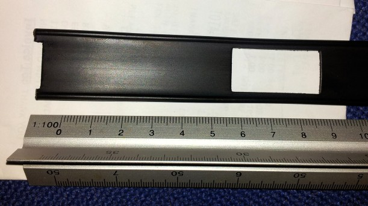

ZS6BKW wire antenna
-------------------

**Some background**  
When looking for a good multi-band HF antenna to erect at home, I
initially looked at the G5RV wire antenna; it is often claimed as a
match-anywhere general purpose HF antenna. Further research reveled that
it was never intended to be multi-band, and had only relatively recently
been 'sold' as such. An antenna that does perform how the G5RV is
claimed to perform is the variant invented by It was derived by Brian
Austin ZS6BKW (now G0GSF). It's essentially a shorter G5RV with improved
matching network. With some care in building and siting, it can give
excellent results on all bands from 80m to 6m (excluding 30m and 15m,
though a good ATU will easily load the antenna on these bands too).

  
**The design**  
The ZS6BKW uses a section of ladder-line feeder as an impedance
transformer to match the centre of the two wire elements to 50 Ohms at
the radio end of the feeder. It's the characteristics of this
ladder-line section that determine the length of the wire elements. In a
coming update to this page I'll put the mathematics behind this antenna,
but for now, if you use 450 Ohm ladder-line, then the wire elements need
to be 13.75 meters long for a total element length of 27.5 meters.

  
**The construction**  

A semi-flexible plastic chopping board was purchased and cut up and
drilled to make a strong centre piece for the antenna.  
The feeder is clamped securely between two sections of chopping board,
the arms of the antenna are woven though the smaller holes in the
crosspiece of the centre and then joined to the feeder via soldering.
The aim is to get a good electrical connection, while also providing
good mechanical stability - this thing will be anything up to 80 feet in
the air in strong winds, hot sun and freezing conditions; quite possibly
all three simultaneously on a typical British summer day.

The feeder was purchased from [Moonraker UK](http://www.moonraker.eu),
it is strong copper clad steel wire in tough ABS plastic, with window
cutouts to reduce wind loading. I've used the same feeder at home for
the same type of antenna for over two years with excellent results.

At this point there should be a photograph of the constructed centre
piece with wires and feeder attached, but I forgot to take one.  
---- **Results**  

Once the antenna was constructed it was hoisted into place, with one end
up at about 80 feet above ground , the other at about 12 feet above
ground with the feeder hanging directly down. This sloping configuration
isn't ideal for this type of antenna, but was the best we could manage,
keeping feeders and elements reasonable distances from the metal tower.

Measurements of VSWR and return loss were made with an SDR-KITS Vector
Network Analyser. The VSWR trace shown displays dips in the VSWR
corresponding to the amateur bands and other non-amateur bands. As yet
this antenna is not optimised, the VSWR should be rather better than
measured, however a decent ATU has no problems tuning from 80m to 10m.

At construction time, the feeder was cut generously, when time allows I
shall return to the bunker and trim the feeder length by a inches at a
time while measuring the VSWR again. This should enable a better match
to 50 Ohms in the sections of the amateur bands we prefer.
