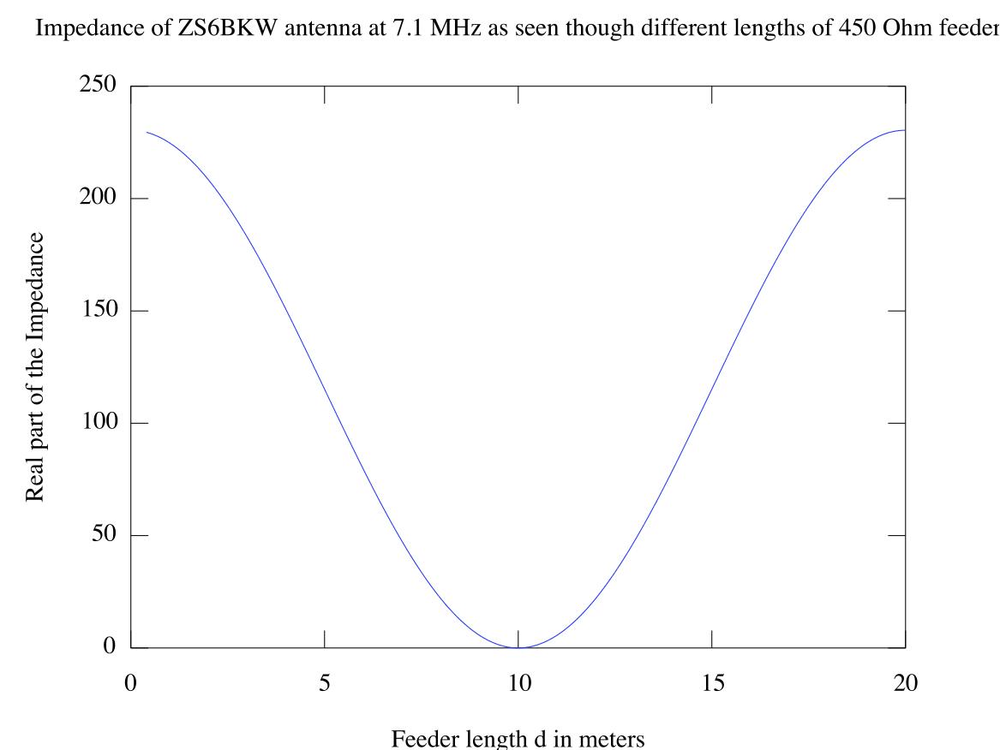

Introduction
------------

Wire antennas with open wire feeder matching stubs have interested me
for a number of years; from the ubiquitous G5RV and the optimized ZS6BKW
designs, to doublets and similar antennas, the wire feeder is an
integral part of the design. The feeder forms a transmission line
transformer, matching the impedance of the antenna's feed point to that
of the RF source.

  

The ZS6BKW multi-band antenna
-----------------------------

The ZS6BKW is the multiband antenna I use at home and at the Kelvedon
Hatch secret nuclear bunker special even station - GB0SNB, so it is the
one I will investigate a the operation of. The antenna is constructed
from 27.5m of wire (2 x 13.75 elements) fed with either 13.3m of 300 Ohm
or 12.2m of 450 Ohm open wire feeder.

Good matching to a 50 Ohm RF source (SWR &lt; 2) is achieved on the
following bands: 40, 20, 17, 12, 10, and 6 meters. Use of an ATU allows
80m and 15m to be matched too.

How does a short length of open wire feeder manage this? Read on.

  

Mathematics
-----------

Antenna design and analysis really requires mathematics, you can try to
short cut the maths by experimentation, but you're never going to really
develop anything new or any understanding of what's going on without at
least a little maths. The Telegrapher's Equations describe the behaviour
of voltages and current on a transmission line as a function of time and
distance from the source (for a lossless line)

$$\\frac{\\partial}{\\partial x} I(x,t) =
-C \\frac{\\partial}{\\partial t} V(x,t)$$

$$\\frac{\\partial}{\\partial x} V(x,t) =
-L \\frac{\\partial}{\\partial t} I(x,t)$$

  
It can be shown (but I'm not doing it here) that in the case of a
sinusoidal signal on a transmission line of length
*d* with characteristic impedance
*Z*0 terminated with a load
impedance *Z**L*, the input
impedance Zin of the line is given by:

$$Z\_{in}(d) = \\frac{Z\_L cos\\beta d + jZ\_0 sin \\beta d}{Z\_0 cos \\beta d + j Z\_L sin \\beta d}$$

where $\\beta = \\frac{2\\pi}{\\lambda}$

**A simple example:**

It is commonly known that a λ/2 (half-wave) length of feeder presents to
the radio the same impedance as the antenna it is connected to,
regardless of the feeder characteristic impedance. Using the the above
equation for Zin we can plot the value of Zin vs
feeder length for a simple monoband dipole.

We shall take λ to be 40m,
*Z**L* = 73 Ohm (assuming
perfect ideal dipole) and *Z*0 =
450 Ohm

The plot clearly shows that when the feeder length is 20m, the impedance
is 73 Ohm - just as is expected. We can also see that the plot is
cyclical, we get the same impedance transference at 40m, 60m and 80m
(though the last two are inferred, not shown). Inspecting the plot, we
can also see that if the feeder length is 10m (lambda/4) the impedance
drops to around zero - giving what is commonly known as a “current node”
where you have to force essentially infinite current into the antenna to
get any radiation. We can also pick our feeder length to give any
impedance we like between 0 and 73 Ohms.

TODO : Determine what happens to Inductive / Capacitive reactances in
the antenna when transformed by the feedline.

The ZS6BKW analyzed
===================

To start analysing this antenna we first need to know
*Z**L* at the frequencies of
interest. We can't just use 73 Ohm as in the simple 40m dipole example,
because the dimensions of the ZS6BKW are not those of a simple dipole on
any of the bands we are interested in. To avoid a lot of mathematics, I
used
[CocoaNEC](http://www.w7ay.net/site/Applications/cocoaNEC/index.html)
antenna modeling software to compute
*Z**L*. The model assumes the
antenna is 30 feet high, constructed from 2 mm2 copper wire
over a standard NEC ground simulation.

This is the CocoaNEC code for a simple wire dipole with
ZS6BKW dimensions:  

    model ( "dipole" )
    {
    real height, length&nbsp;;
    element driven&nbsp;;

    height = 30'&nbsp;;
    length = 27.5/2&nbsp;;
    driven = wire( 0, -length, height, 0, length, height, #14, 21 )&nbsp;;
    voltageFeed( driven, 1.0, 0.0 )&nbsp;;

    setFrequency( 7.0 )&nbsp;;
    addFrequency( 7.05 )&nbsp;;
    addFrequency( 7.1 )&nbsp;;
    addFrequency( 7.15)&nbsp;;
    addFrequency( 7.20)&nbsp;;
    } 

40m
---

Running the model for the 40m (7 MHz) band, we get the following complex
impedances at the feed point of the antennna:

Frequency 7.000 MHz - Z: (213.460 + i 650.080)  
Frequency 7.050 MHz - Z: (221.760 + i 670.960)  
Frequency 7.100 MHz - Z: (230.400 + i 692.090)  
Frequency 7.150 MHz - Z: (239.390 + i 713.470)  
Frequency 7.200 MHz - Z: (248.750 + i 735.100)

This corresponds to ~45:1 VSWR to a 50 Ohm source, obviously we need to
transform this down. To simplify the graph, I'll only use the 7.1 MHz
data - it's the middle of the European band, and the band is narrow
enough that whatever works midband should be ok at the band edges too.

From the plot it is easy to see that we can get 50 Ohm impedance if we
use a feeder of length either 7.5m or 12.5m. A current node can be seen
with a feeder length of 10m.

In doing this analysis, I did not consider the complex part of the of
the antenna feedpoint impedance. This is because I am not yet sure
exactly what happens with regards to transformed complex impedance, and
because the results I get by ignoring them correspond very well to the
results measured in real world versions of this antenna.

Other bands
-----------

    1.80  MHz Z: (1.74900 - j1863.800) 
    1.85  MHz Z: (1.82400 - j1802.200) 
    1.90  MHz Z: (1.90600 - j1743.500) 
    1.95  MHz Z: (1.99700 - j1687.400) 
    3.50  MHz Z: (11.1660 - j641.700) 
    3.55  MHz Z: (11.7610 - j619.460) 
    3.60  MHz Z: (12.3830 - j597.570) 
    3.65  MHz Z: (13.0330 - j576.020) 
    3.70  MHz Z: (13.7100 - j554.790) 
    3.75  MHz Z: (14.4170 - j533.870) 
    3.80  MHz Z: (15.1530 - j513.230) 
    7.00  MHz Z: (213.460 + j650.080) 
    7.10  MHz Z: (230.400 + j692.090) 
    7.20  MHz Z: (248.750 + j735.100) 
    10.1  MHz Z: (3435.60 + j1707.300) 
    10.15 MHz Z: (3584.20 + j1604.500) 
    14.1  MHz Z: (165.200 - j741.720) 
    14.2  MHz Z: (153.960 - j693.450) 
    14.3  MHz Z: (141.110 - j630.290) 
    18.1  MHz Z: (241.660 + j550.500) 
    21.1  MHz Z: (2378.40 + j2141.700) 
    21.2  MHz Z: (2694.00 + j2126.700) 
    21.3  MHz Z: (3047.80 + j2056.500) 
    21.4  MHz Z: (3431.40 + j1910.000) 
    24.2  MHz Z: (337.690 - j1091.900) 
    28.1  MHz Z: (163.490 + j281.610) 
    28.2  MHz Z: (169.820 + j309.460) 
    28.5  MHz Z: (192.100 + j394.310) 
    29.0  MHz Z: (241.890 + j541.910) 
    29.5  MHz Z: (314.230 + j700.970) 
    50.0  MHz Z: (184.230 + j295.520) 
    50.1  MHz Z: (189.940 + j319.650) 
    50.2  MHz Z: (196.050 + j343.680) 
    50.3  MHz Z: (202.570 + j367.610) 

  

